**2022级《程序设计基础课程设计》总结报告（第 组）**

<table><tr><td>
<strong>学号</strong>
</td><td>
<strong>姓名</strong>
</td><td>
<strong>性别</strong>
</td><td>
<strong>班级</strong>
</td><td>
<strong>具体任务分工</strong>
</td><td>
<strong>所占比例</strong>
</td><td>
<strong>成绩</strong>
</td></tr><tr><td></td><td></td><td></td><td></td><td>
组长

设计程序整体功能，分配任务；

销售记录链表的后台API与前台页面逻辑；

客户操作(浏览商品、查询记录等)功能的后台API；

管理代码仓库master分支的进程，审核新的功能代码，管理合并，处理代码冲突；

构造测试数据，调试程序；
</td><td>
30%
</td><td></td></tr><tr><td></td><td></td><td></td><td></td><td><ol><li>用梯度下降算法拟合回归方程预测盈亏。（机器学习）</li><li>在后期对所有代码进行整合以适配GUI。</li><li>用graphpage.cpp的5000行代码搭建基于Easyx的GUI，进行功能的串接。</li><li>图形界面中盈亏折折线图，商品饼状图，线性回归图，以及用户的解封。</li></ol></td><td>
25%
</td><td></td></tr><tr><td></td><td></td><td></td><td></td><td><ol><li>登录界面及其相关功能实现，包含MD5算法、文件备份、封禁等。</li><li>完成用户界面的功能实现，包含模糊搜索、修改密码、购物车链表、余额系统等。</li><li>维护记录、商品、客户、购物车四条链表，使其串接并交互。</li><li>完成管理员界面中商品链表的构建，并实现相关操作。</li><li>辅助完成仓库中不同分支的合并,以及调试。</li></ol></td><td>
25%
</td><td></td></tr><tr><td></td><td></td><td></td><td></td><td>
1，实现总览界面，遍历记录链表，计算出每天营业额。

2，建立一个时间结构体，读取当前年月日。

3，退换货实现，原因表单的提交，审核，通过。

4，完成客户链表的构建，并实现相关操作。
</td><td>
20%
</td><td></td></tr><tr><td colspan="7">
<strong>填写说明：</strong>
</td></tr><tr><td colspan="7">
1、请将首页红色部分信息填全，其中：学号为8位数字，计算机科学与技术学院通常以21开头、软件学院通常以55开头、人工智能学院通常以40开头；班级为6位数字；所占比例为百分数，比例值个位数为0或5，且所有人的所占比例之和为100%；人数不足的分组请保留后面的多余空行，请勿修改该表的结构。

2、请根据实际情况填写具体任务分工，主要任务包括：软件系统的总体分析与设计，具体功能的设计与实现，对应的测试与验证过程（报告正文需要列出若干组具体测试样例与对应结果），系统界面的设计与美工，以及辅助工具、视图和文件等。

3、成绩评定由指导教师填写，学生本人请勿填写和修改。
</td></tr></table>

提交日期：2023年4月20日

**报告正文**

【请用小四号宋体填写，自行组织章节和段落】

I. 小组分工合作情况

小组学习并使用了当今较为流行的**分布式版本控制系统（git）**，并使用线上的代码托管平台gitee.com来方便合作开发程序。

得益于该系统的功能，小组可以高效的对仓库内代码进行分支、合并、变基、迭代、回滚、控制版本等操作。

在实际开发过程中，组长负责管理代码仓库的master分支（主分支），其余组员每人一条以名字命名的分支，并允许在开发中开辟新的分支。在完成一个功能开发后，组长将审核并且测试组员分支的代码，合并至master，并处理代码间的冲突。

对仓库的每一次commit，需要撰写详细的开发日志，报告已知的bug位置，方便其他组员查阅。

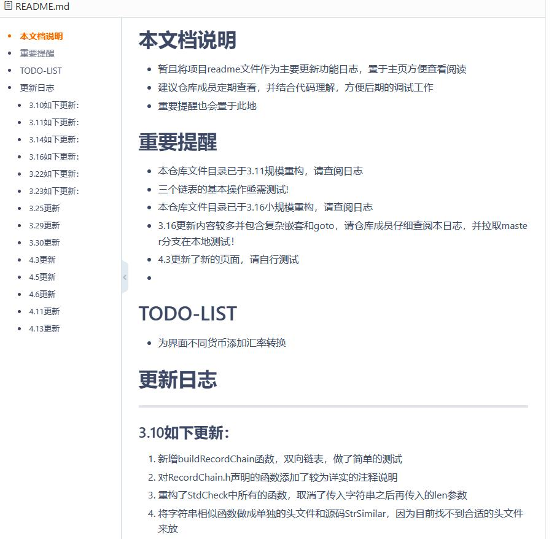  
部分开发日志 1

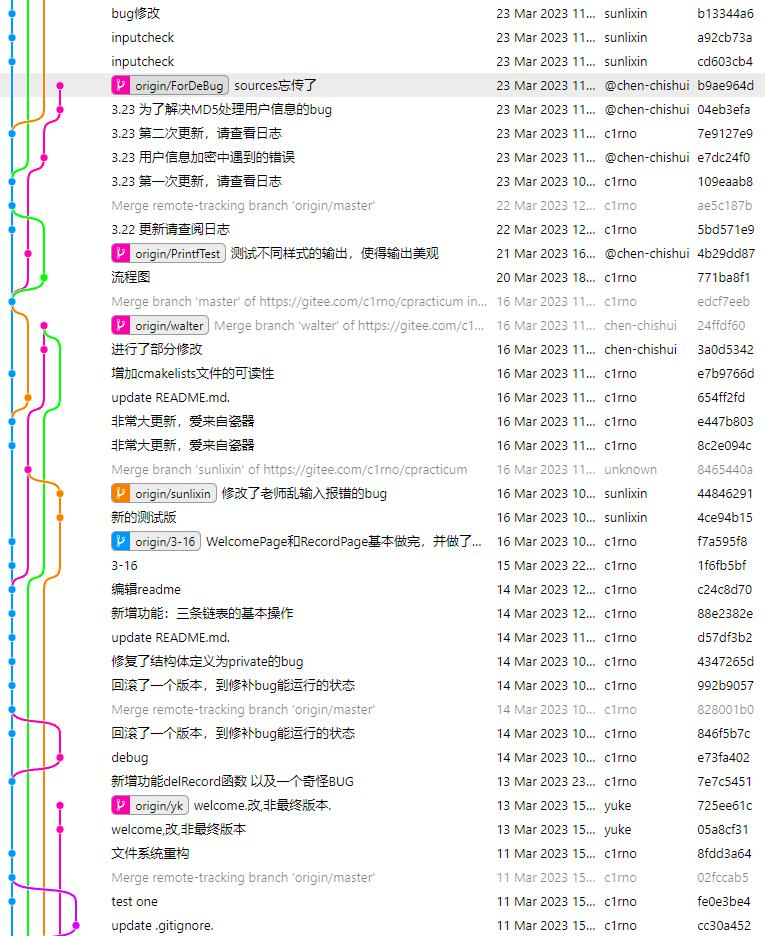  
部分分支迭代情况 1

小组使用CMake工具来描述项目目标文件与依赖库，以处理不同组员本地环境不同的问题。在仓库中只存储项目源码和makelists文件，任意开发者将最新的代码拉取到本地后，执行makelists便可以根据本地的编译器编译、链接、生成可执行文件。

II. 程序特色功能概述

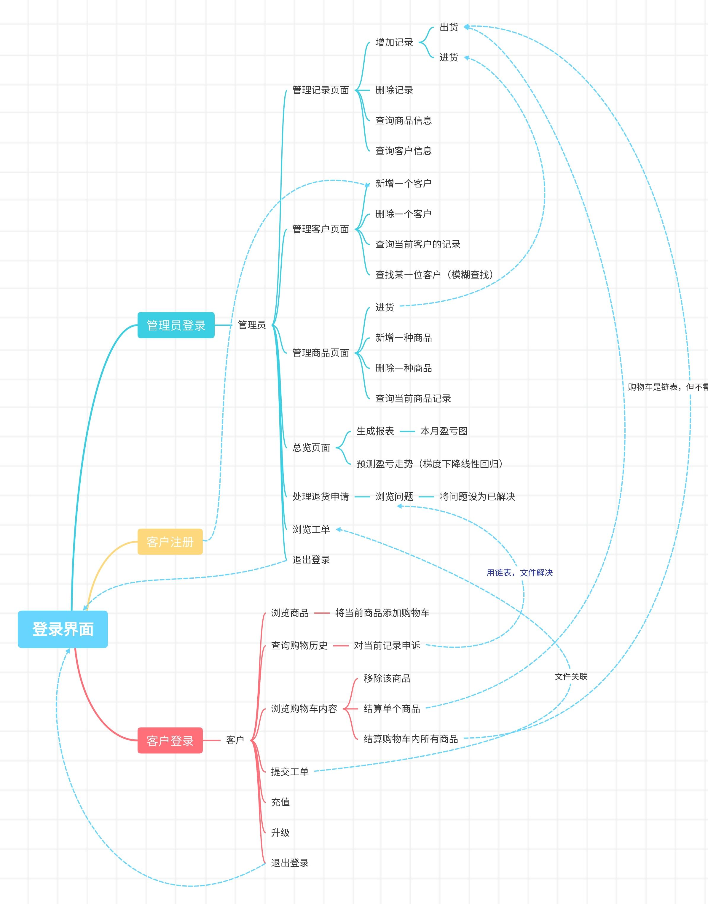  
程序主要功能流程图 1

1. 基于easyx图形库的人性化GUI交互和美观的图表功能

程序全部基于easyx图形库开发，实现了人性化的GUI交互，丰富的鼠标反馈，严谨的非法输入检测，和丰富美观的图表功能（例如每件商品有饼状图表示售出占比，历史盈亏情况图用折线图表示）。

2. 基于机器学习的盈亏预测

使用机器学习中梯度下降（Gradient Descent）的算法，对本月的盈亏记录进行线性拟合回归，并预测将来的盈亏情况。

3. MD5信息摘要加密算法

为保护客户隐私，加强信息安全性，程序在本地不存储任何账号的明文账户名和密码，转而使用当今广泛采用的MD5信息摘要算法对账号和密码生成哈希值，并在用户键入以哈希值比较正确性。

4. 订单申诉，退款功能

客户可以对已购买的订单发起申诉，填写工单，管理员可以读取并一键处理退货请求。即一键归还商品存量，用户余额，将销售记录标记无效。

5. 基于字符串向量余弦相似度的模糊查找算法

对于需要用户通过关键词搜索的功能，使用字符串向量余弦相似度（Cosine Similarity）比较算法衡量记录与用户键入值的相似性，对高于匹配阈值的记录近似的看做用户意图查找目标，以此来提高用户输入的容错空间。

6. 严谨的内存垃圾处理与实时硬盘文件重写

程序对所有内存与硬盘空间采用严格的实时管理办法，用户的每一次操作都会立刻反映到内存垃圾的处理和文件的重写与覆盖中，力求避免内存泄露问题，并在意料外的退出甚至崩溃等事件下可以保护数据。

7. 自动数据备份容灾功能

程序在读取数据正常启动后会自动生成一份同名的数据备份文件，来避免意料外的文件损坏或数据丢失等错误。

III. 程序完整功能详述

# 1. 进入程序后首先需要登录，提供如下操作

  
登录界面 1

## 1.1. 用户登录

## 1.2. 管理员登录

## 1.3. 用户注册

登录失败五次会自动**封禁用户**，再次登录会提示禁止登录

程序在本地不存储用户明文的账号名和密码，而是对应的MD5哈希值

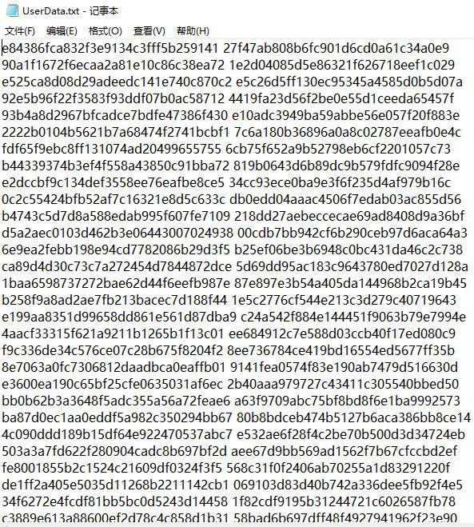  
加密后的用户登录数据 1

新注册的用户余额为0，等级为0

注册完成后的用户会被加入程序维护的用户链表中并写入文件

# 2. 管理员登录成功后会显示管理员界面，提供如下操作

  
管理员页面 1

## 2.1. 查看客户

该操作会调用内存中的客户链表，一次显示一个客户的详细信息，包括用户名、等级（涉及折扣）、身份（用户/批发商）、注册日期（链表内部默认按照注册日期排序）、封禁状态，并提供如下操作。

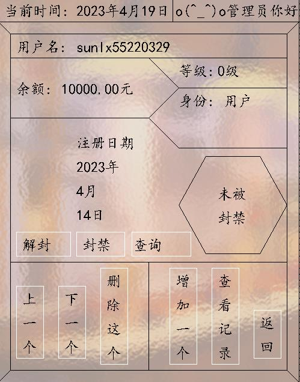  
管理员查看用户页面 1

### 2.1.1. 翻页（上一个，下一个）

### 2.1.2. 删除当前客户

### 2.1.3. 新增客户（跳转至用户注册页面）

### 2.1.4. 封禁/解封

### 2.1.5. 查询

该操作为模糊查询，管理员可以搜索用户名，键入时不必完全正确，只需大致相似即可，程序会返回一个最相似的结果

例如我们现在想搜索客服pifashang，而错误的拼成了pitasang

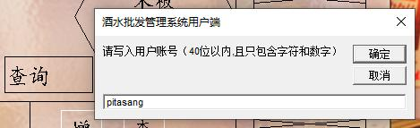  
模糊查询 1

程序会自动返回所有用户中最相似的结果

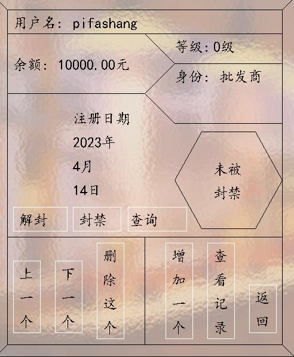  
程序对模糊查询pitasang返回的结果 1

### 2.1.6. 查看记录（调用记录链表，显示该客户所有相关的购买记录）

在查看记录详情中显示如下信息：商品名称、售价、折后价（根据用户记录产生时的等级计算）、总数、日期、**退款状态（正常/申请退款未处理/申请退款已处理）**，并且提供如下操作：

  
管理员查看用户相关记录页面 1

#### 2.1.6.1. 翻页（上一个商品/下一个商品）

#### 2.1.6.2. 删除这条记录

## 2.2. 查看商品

该操作会调用内存中的商品链表，进入商品详情页面，一次显示一个商品，展示如下信息：商品名称、剩余库存、售价、进价、**销售占比图（销售量占总销售量的比例，用以衡量商品的受欢迎程度）**

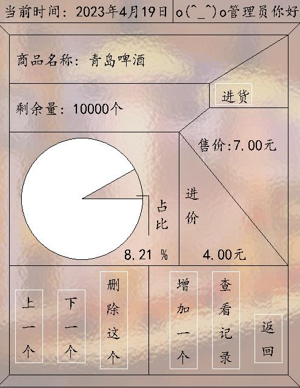  
管理员查看商品详情页面 1

该页面提供如下几种操作：

### 2.2.1. 翻页（上一个/下一个商品）

### 2.2.2. 删除这个（移出链表，释放空间，客户不能再购买，但是已经购买的记录会保留）

### 2.2.3. 增加一个（填入商品名称，进价，售价来新增一个商品，客户可以立刻看到）

### 2.2.4. 查看记录（调用记录链表，显示所有和当前商品相关的记录）

## 2.3. 销售记录

该页面是本程序核心链表，商品存量，用户余额等重要信息都对该链表负责，一次显示一条记录，展示如下信息：用户名、历史等级、身份（进货商/普通用户）、商品名称、进价、售价、折后价、数量、状态（未申请售后，申请售后未处理、已处理）、交易时间。

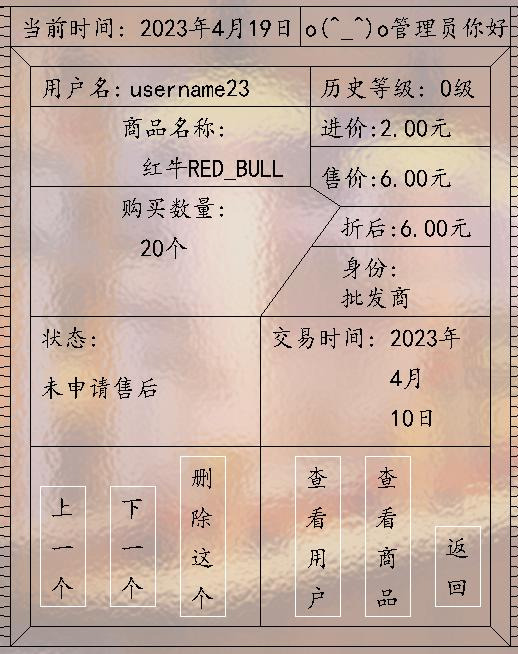  
管理员查看所有记录页面 1

提供以下几种操作：

### 2.3.1. 翻页（上一个/下一个）

### 2.3.2. 删除这个（移出链表，释放空间，）

### 2.3.3. 查看用户（调用用户链表，查询产生记录的用户的详情）

### 2.3.4. 查看商品（调用商品链表，查询该商品的详情）

## 2.4. 退货申请

该页面会调用退货申请链表，显示待处理的退货申请，显示以下几种信息：商品名称、售价、折后价、总数、时间、用户（退货理由详见f-查看工单）

  
管理员查看退货申请页面 1

**如果准许退款，会立即移出待处理链表，归还商品存量，用户余额，将该条记录标记为已经退款，统计时不再计入。**

## 2.5. 总览页面

该页面内部细分为两个功能

### 2.5.1. 查看本月盈亏明细

  
管理员查看本月盈亏明细界面 1

### 2.5.2. **预测明日盈亏结果**

利用机器学习中的梯度下降（Gradient Descent）算法拟合出一条直线来预测明天的营业额，并展示学习过程

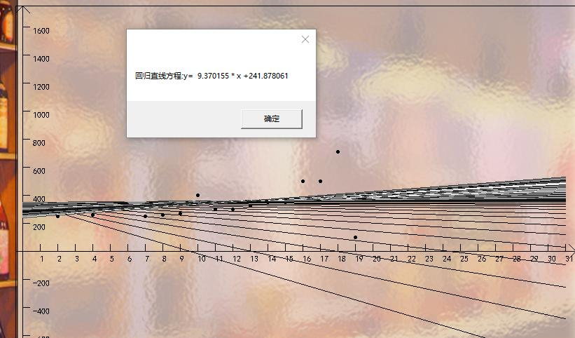  
梯度下降算法学习过程和预测结果 1

## 2.6. 查看工单

该操作会调用所有工单文件并且展示

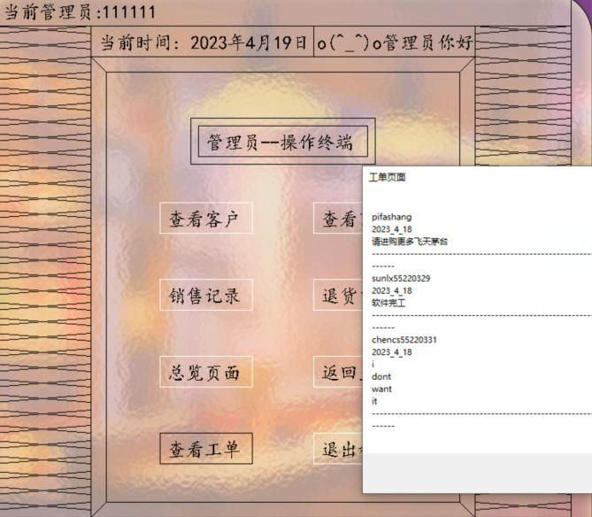  
管理员查看工单页面 1

***以上为所有管理员功能，下面展示用户功能***

# 3. 用户登录成功后显示用户界面

  
用户首页 1

该页面是用户首页，显示如下信息：当前用户名、时间、余额、等级、折扣

用户的等级（1-5）和身份（批发商/零售）会影响折扣等级

提供以下几个操作：

1. 查看所有在售商品

该操作会调用在售商品链表的，一次展示一件商品的信息，有：商品名称，商品价格，剩余存量

  
用户查看商品页面 1

提供以下几种操作

1. 翻页（上一个/下一个）
2. 加入购物车（购物车是维护的另一条链表，只存在于内存中，没有文件依赖）

在加入购物车时，程序会根据用户身份（批发商/零售商）和等级来自动打折，特别的，对于批发商，单次进货不能少于100单位

1. 购物历史

该操作会调用记录链表，检索出和用户相关的历史记录，每次展示一条，信息包括：商品名称、售价、折后价（注意是根据历史等级计算而非当前）、总数、状态（正常、申请售后未处理、申请售后已处理）

  
用户查看购买记录页面 1

提供以下操作

1. 翻页（上一个/下一个）
2. 对当前记录申请售后

该操作会将售后请求加入售后请求链表中，在管理员端可以看到

1. 查看购物车

该操作会调用购物车链表，一次展示一条，内容有：商品名称、原价、折后价、商品个数

  
用户查看购物车界面 1

提供以下操作

1. 翻页（上一个/下一个）
2. 从购物车移出（删除）
3. 支付（支付当前商品）
4. 清空（结算所有商品）

对于支付和清空操作，会检查用户余额和商品存量，任意一个不足都会报错，并且停止在出错的购物车节点处，保留后继节点，之前正常结算的节点会照常结算，并且产生记录，记录会带动修改用户余额和商品存量。

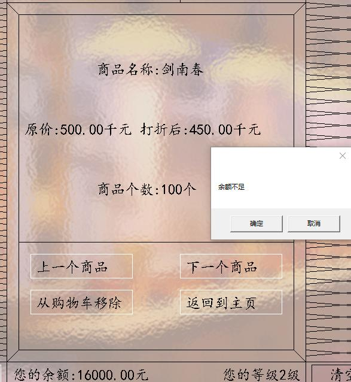  
余额不足 1

1. 提交工单

用户可以提交一段工单，可以包含所有字符，包括中英文，特殊字符，空格，换行符等，用以处理问题

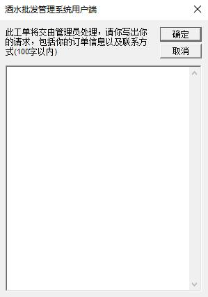  
提交工单 1

1. 修改密码

填写的新密码会实时转换MD5格式写入文件

1. 充值
2. 升级

升级需要额外消费来达到更高等级，额外的，高等级会带来更高级的折扣