# 2023级《程序设计基础课程设计》总结报告（第XX组）

| 学号 | 姓名 | 性别 | 班级 | 具体任务分工 | 所占比例 | 成绩 |
|------|------|------|------|-------------|---------|------|
| 25230726 | 郭承宇 | 男 | | 组长 | 65% | |
|  |  |  |  | 1. 负责系统总体方案、类层次关系和主要业务流程设计； |  |  |
|  |  |  |  | 2. 负责 `main.cpp` 主程序流程，包括启动加载、登录注册分发、角色菜单调用、退出保存和异常保存； |  |  |
|  |  |  |  | 3. 负责 `User` 基类中枚举类型、公共字段、状态转换、费用计算等公共能力设计； |  |  |
|  |  |  |  | 4. 负责管理员模块主要功能，包括账户管理、医疗记录管理、药品管理、药品流水管理、床位管理、账户激活与封锁、统计报表和管理员个人信息维护； |  |  |
|  |  |  |  | 5. 负责登录验证、密码加盐哈希、连续失败锁定和模板化账户管理功能； |  |  |
|  |  |  |  | 6. 负责 `LoadData.cpp` 与 `SaveData.cpp` 中用户、医疗记录、药品、流水、床位等 txt 数据文件的读写逻辑； |  |  |
|  |  |  |  | 7. 负责终端交互公共函数、菜单样式、分页显示、输入校验、操作日志与部分测试数据整理； |  |  |
|  |  |  |  | 8. 负责主要代码审查、问题定位、开发日志维护和最终文档整理。 |  |  |
| 17230314 | 李阳旭 | 男 | | 组员 | 35% | |
|  |  |  |  | 1. 负责医生模块功能，包括挂号管理、看诊记录管理、检查记录管理和医生个人信息维护； |  |  |
|  |  |  |  | 2. 负责护士模块功能，包括检查记录维护、住院记录维护、床位分配、床位调整、出院办理和护士个人信息维护； |  |  |
|  |  |  |  | 3. 负责药剂师模块功能，包括用药记录创建、处方审核、用药明细维护、发药、库存查看和药剂师个人信息维护； |  |  |
|  |  |  |  | 4. 负责患者模块功能，包括预约挂号、挂号缴费与撤回、检查缴费、用药缴费、住院押金缴纳、账户充值和患者个人信息维护； |  |  |
|  |  |  |  | 5. 参与 `Registration`、`Consultation`、`Examination`、`Hospitalization`、`MedicationRecord`、`Medicine`、`MedicineFlow`、`bedInfo` 等结构体字段完善； |  |  |
|  |  |  |  | 6. 参与各角色菜单联调、数据文件检查、非法输入测试和功能缺陷修复。 |  |  |
| 填写说明： |  |  |  |  |  |  |
| 1、请将首页红色部分信息填全，其中：学号为8位数字，计算机科学与技术学院通常以21开头、软件学院通常以55开头、人工智能学院通常以40开头；班级为6位数字；所占比例为百分数，比例值个位数为0或5，且所有人的所占比例之和为100%；人数不足的分组请保留后面的多余空行，请勿修改该表的结构。 |  |  |  |  |  |  |
| 2、请根据实际情况填写具体任务分工，主要任务包括：软件系统的总体分析与设计，具体功能的设计与实现，对应的测试与验证过程（报告正文需要列出若干组具体测试样例与对应结果），系统界面的设计与美工，以及辅助工具、视图和文件等。 |  |  |  |  |  |  |
| 3、成绩评定由指导教师填写，学生本人请勿填写和修改。 |  |  |  |  |  |  |

提交日期：2026年5月XX日

## 报告正文

【请用小四号宋体填写，自行组织章节和段落】

## I. 小组分工合作情况

本小组选择"小型医疗管理系统"作为课程设计题目。最终提交程序为 C++17 控制台交互程序，入口文件为 `main.cpp`，主要头文件位于 `Head/`，主要实现文件位于 `Source/`，运行数据以 txt 文本形式保存在 `Data/` 目录下。程序通过终端菜单完成注册、登录、不同角色业务处理、数据保存和退出操作。

在开发过程中，小组使用 Git 进行版本管理。组长负责主线代码维护、整体结构设计、公共模块与管理员模块开发，并对组员提交内容进行合并检查；组员负责医生、护士、药剂师、患者等角色模块的业务实现与联调。小组同时维护 `DevelopLog.md`，按照日期版本号记录阶段性修改内容、已发现问题和修复情况，便于回顾开发过程和定位错误。

   
  <em>▲ 部分开发日志截图</em>

  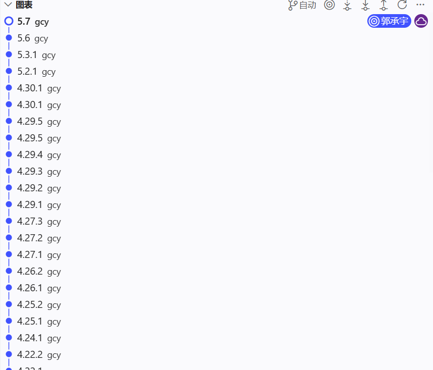 
  <em>▲ 部分提交记录截图</em>

构建方面，小组使用 CMake 描述控制台程序的编译规则，采用 C++17 标准。实际运行时需要先在项目根目录下建立并进入 `build/` 目录，执行 `cmake ..` 完成配置，再执行 `cmake --build . --config Debug` 生成可执行文件。由于数据文件路径在代码中以 `../Data/` 为相对路径，程序需要从 `build/` 目录启动，才能正确读取和保存 txt 数据文件。

  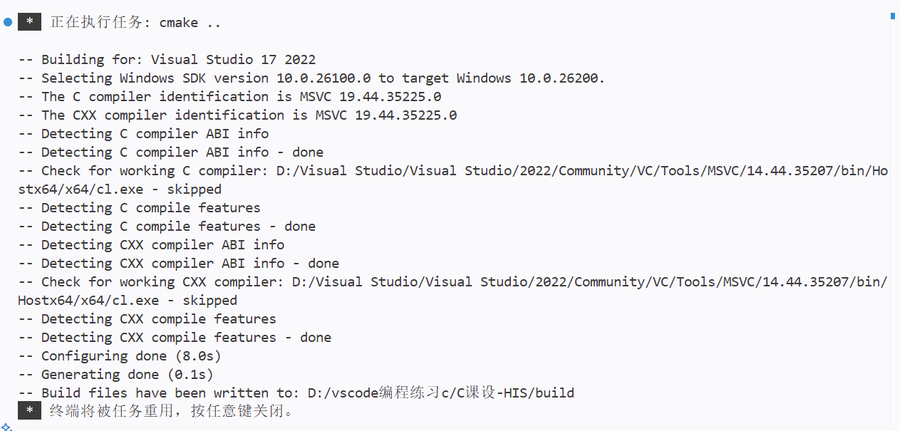 
  <em>▲ CMake 配置成功输出截图</em>

   
  <em>▲ 控制台程序编译成功输出截图</em>

---

## II. 程序特色功能概述

程序的总体功能结构见题签中的功能简图。系统围绕"患者挂号 → 医生看诊 → 护士检查与住院管理 → 药剂师用药管理 → 管理员统一维护"这一流程组织代码，实现了五类角色的菜单分发和权限区分。

### 系统整体架构

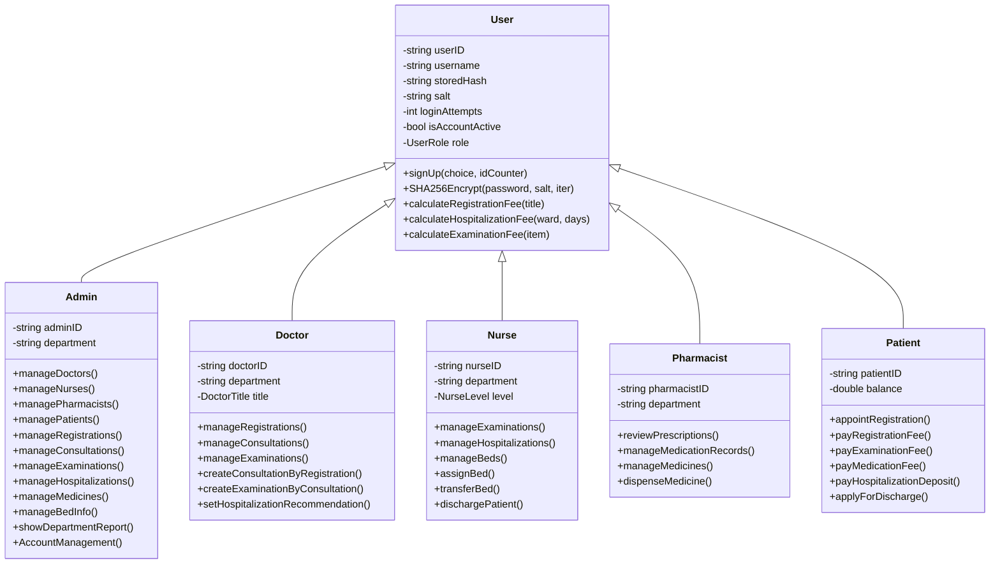
```mermaid
classDiagram
    class User {
        -string userID
        -string username
        -string storedHash
        -string salt
        -int loginAttempts
        -bool isAccountActive
        -UserRole role
        +signUp(choice, idCounter)
        +SHA256Encrypt(password, salt, iter)
        +calculateRegistrationFee(title)
        +calculateHospitalizationFee(ward, days)
        +calculateExaminationFee(item)
    }
    class Admin {
        -string adminID
        -string department
        +manageDoctors()
        +manageNurses()
        +managePharmacists()
        +managePatients()
        +manageRegistrations()
        +manageConsultations()
        +manageExaminations()
        +manageHospitalizations()
        +manageMedicines()
        +manageBedInfo()
        +showDepartmentReport()
        +AccountManagement()
    }
    class Doctor {
        -string doctorID
        -string department
        -DoctorTitle title
        +manageRegistrations()
        +manageConsultations()
        +manageExaminations()
        +createConsultationByRegistration()
        +createExaminationByConsultation()
        +setHospitalizationRecommendation()
    }
    class Nurse {
        -string nurseID
        -string department
        -NurseLevel level
        +manageExaminations()
        +manageHospitalizations()
        +manageBeds()
        +assignBed()
        +transferBed()
        +dischargePatient()
    }
    class Pharmacist {
        -string pharmacistID
        -string department
        +reviewPrescriptions()
        +manageMedicationRecords()
        +manageMedicines()
        +dispenseMedicine()
    }
    class Patient {
        -string patientID
        -double balance
        +appointRegistration()
        +payRegistrationFee()
        +payExaminationFee()
        +payMedicationFee()
        +payHospitalizationDeposit()
        +applyForDischarge()
    }
    User <|-- Admin
    User <|-- Doctor
    User <|-- Nurse
    User <|-- Pharmacist
    User <|-- Patient
```

### 医疗业务流程

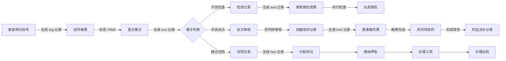
```mermaid
flowchart LR
    A[患者预约挂号] -->|生成 reg 记录| B[挂号缴费]
    B -->|状态: PAID| C[医生看诊]
    C -->|生成 con 记录| D{看诊判断}
    D -->|开具检查| E[检查记录]
    D -->|开具处方| F[处方审核]
    D -->|建议住院| G[住院记录]
    E -->|生成 exa 记录| E1[患者缴检查费]
    E1 -->|执行检查| E2[出具报告]
    F -->|药剂师审核| F1[创建用药记录]
    F1 -->|生成 mrd 记录| F2[患者缴药费]
    F2 -->|缴费完成| F3[药剂师发药]
    F3 -->|扣减库存| F4[药品流水记录]
    G -->|生成 hos 记录| G1[分配床位]
    G1 --> G2[缴纳押金]
    G2 --> G3[办理入院]
    G3 --> G4[办理出院]
```

### 数据持久化流程

```mermaid
flowchart TD
    A[程序启动] --> B[设置控制台 UTF-8 编码]
    B --> C[遍历 Data/ 目录]
    C --> D[loadXxxData 逐文件读取]
    D --> E[解析 CSV 行 - 结构体节点]
    E --> F[头插法构建双向链表]
    F --> G[读取 ID 计数器]
    G --> H[用户登录/注册]
    H --> I[角色菜单操作]
    I --> J[链表节点增删改]
    J -->|关键操作| K[LogManager 写日志]
    J --> L{退出方式}
    L -->|正常退出| M[saveXxxData 遍历链表]
    L -->|Ctrl+C 或异常| N[emergencySave 紧急保存]
    M --> O[CSV 格式化写入 txt]
    N --> O
    O --> P[释放链表内存]
```

### 登录安全流程

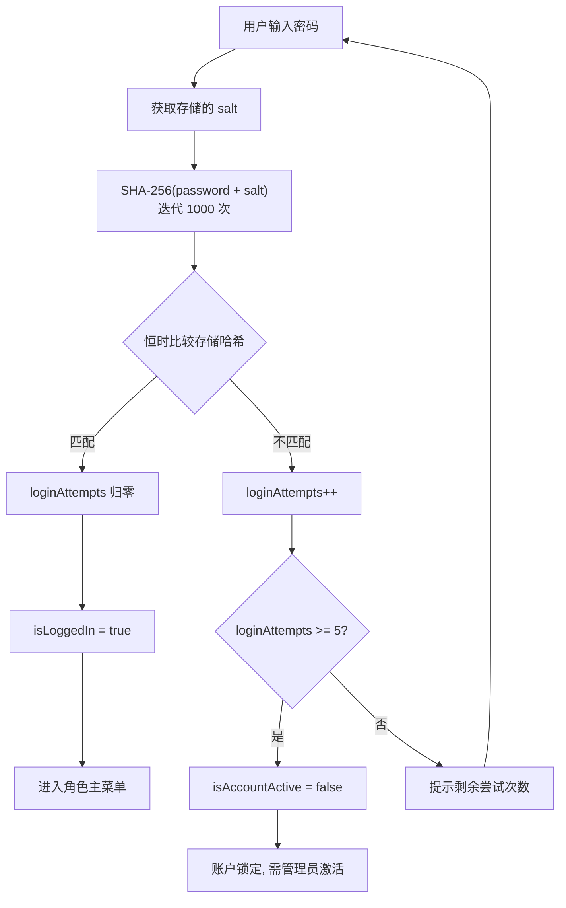
```mermaid
flowchart TD
    A[用户输入密码] --> B[获取存储的 salt]
    B --> C["SHA-256(password + salt)<br/>迭代 1000 次"]
    C --> D{恒时比较存储哈希}
    D -->|匹配| E[loginAttempts 归零]
    E --> F[isLoggedIn = true]
    F --> G[进入角色主菜单]
    D -->|不匹配| H[loginAttempts++]
    H --> I{loginAttempts >= 5?}
    I -->|是| J[isAccountActive = false]
    J --> K[账户锁定, 需管理员激活]
    I -->|否| L[提示剩余尝试次数]
    L --> A
```

### 1. 五角色权限体系与账户安全

系统设置管理员、医生、护士、药剂师、患者五类用户。五类用户均继承自 `User` 基类，在各自链表中保存账户和业务字段。用户 ID 为 6 位数字，首位表示角色（0-管理员、1-医生、2-护士、3-药剂师、4-患者），后五位由该角色计数器递增生成。

注册和修改密码时，系统生成随机盐值（16 位字符），使用 SHA-256 算法进行 1000 次迭代哈希，保存格式为 `salt$hash`。密码验证时采用恒时比较（volatile XOR 循环），防止时序攻击。登录校验失败达到 5 次后，账户会被锁定（`isAccountActive = false`），需由管理员重新激活。

   
  <em>▲ 登录与注册主菜单截图</em>

   
  <em>▲ 密码加盐哈希后的用户数据文件截图</em>

### 2. 双向链表与文本文件持久化

系统主要数据均采用动态内存双向链表保存，节点中包含 `prev` 与 `next` 指针。链表包括 5 类用户链表，以及挂号、看诊、检查、住院、用药、药品、药品流水、床位等业务链表。新增节点主要使用头插法（O(1)）加入链表，删除操作采用设置 `isDeleted` 标志的逻辑删除方式，避免物理删除带来的指针断裂风险。

`LinkedList<T>` 模板类（`Head/LinkedList.h`）提供完整的双向迭代器、`operator[]` 随机访问、`push_back`/`erase` 操作和拷贝/移动语义，用于结构体内部的嵌套集合（如处方列表、检查项目列表、药品别名等）。

程序启动时从 txt 文件加载数据到链表，退出或异常保存时再写回对应文件。空字段统一使用 `"#"` 作为占位符。结构体中的嵌套链表（如看诊记录中的处方列表、附件列表）以附加行形式写入，行首带有 `PRESCRIPTION:`、`ATTACHMENT:` 等标记前缀。

   
  <em>▲ 用户数据文件截图</em>

   
  <em>▲ 医疗记录数据文件截图</em>

### 3. 终端菜单与输入校验

终端界面由 `UI.cpp` 中的公共函数统一绘制，使用 Unicode 双线框（`╔═╗║╚═╝`）显示菜单，配合彩色提示、CJK 字符宽度计算（`getDisplayWidth()`，中文计为 2 列）、信息卡片（`printInfoCard()`）、分页显示（`printWithPagination()`）和隐藏密码输入（`inputHiddenPwdCheck()`，Windows API `ReadFile` 逐字符读取）等功能，使终端交互更加清晰。

输入方面，系统提供菜单选项（`selectIntCheck`）、金额（`inputFeeCheck`）、整数（`inputIntCheck`）、浮点数（`inputDoubleCheck`）、字符串（`inputStringCheck`，拒绝中英文逗号）、用户 ID（`inputIDCheck`，6 位数字首位 0-4）、记录 ID（`inputRecordIDCheck`，前缀+6 位数字）、密码（`inputPwdCheck`/`inputHiddenPwdCheck`，8 位以上含字母和数字）、性别（`inputGenderCheck`）、电话（`inputTelephoneCheck`，11 位）、邮箱（`inputEmailCheck`）、年龄（`inputAgeCheck`，0-150）、日期（`inputDateCheck`，YYYY-MM-DD）、科室（`inputDepartmentCheck`，5 个预设科室）、身份证号（`inputIDcardCheck`，18 位）、床位编号（`inputBedNumberCheck`）等多类校验函数，减少非法输入对程序运行和文本文件结构造成影响。

  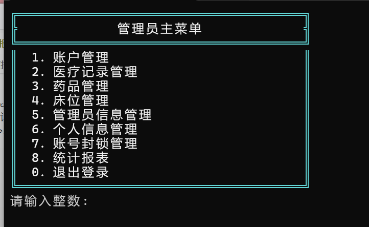 
  <em>▲ 管理员主菜单截图</em>

   
  <em>▲ 非法输入提示截图</em>

### 4. 医疗业务流程串联

系统将挂号、看诊、检查、用药和住院记录通过 ID 字段串联，形成完整的医疗业务闭环：

| 流程步骤 | 创建角色 | 记录类型 | ID 前缀 | 关联字段 |
|---------|---------|---------|--------|---------|
| 预约挂号 | 患者 | Registration | `reg` | patientID, doctorID |
| 看诊记录 | 医生 | Consultation | `con` | registrationID, patientID, doctorID |
| 检查记录 | 医生/护士 | Examination | `exa` | consultationID, patientID, doctorID |
| 用药记录 | 药剂师 | MedicationRecord | `mrd` | consultationID, doctorID, patientID |
| 住院记录 | 护士 | Hospitalization | `hos` | consultationID, patientID, doctorID, nurseID, bedNumber |

患者可预约挂号并缴纳挂号费（按医生职称计费：实习 10 元、住院 20 元、主治 30 元、副高 40 元、正高 50 元）；医生可根据已缴费挂号创建看诊记录，填写病情信息、检查项目、处方和住院建议；医生或护士可维护检查记录；药剂师可根据处方创建用药记录、审核处方并在患者缴费后发药（发药时自动扣减库存）；护士可根据住院建议创建住院记录，完成床位分配、床位调整、押金设置和出院办理（住院费用按病房类型×天数计费：普通 50 元/天、隔离 100 元/天、VIP 200 元/天、ICU 500 元/天）。

  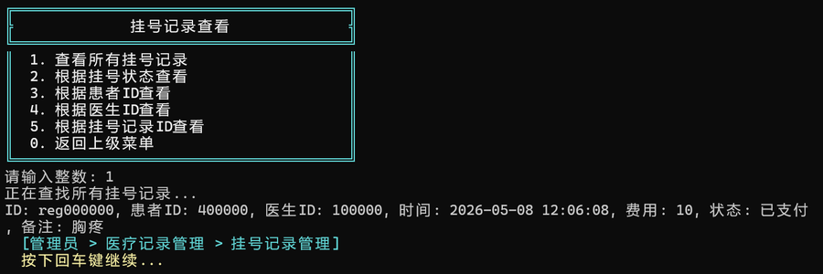 
  <em>▲ 挂号记录截图</em>

  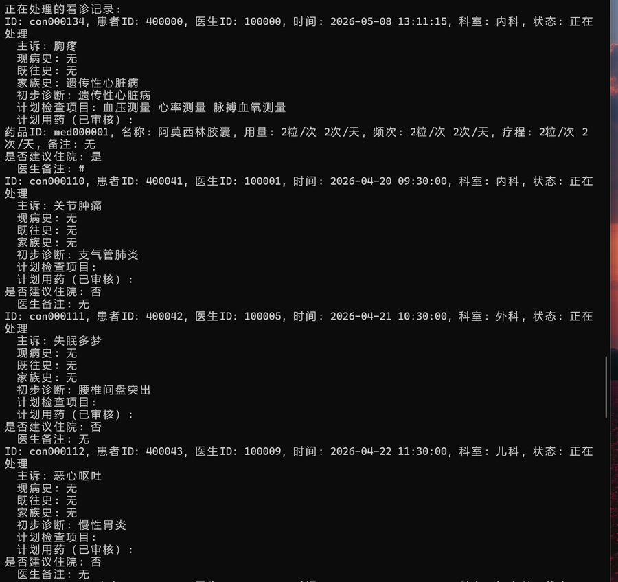 
  <em>▲ 看诊记录详情截图</em>

   
  <em>▲ 用药记录详情截图</em>

### 5. 药品、床位与费用管理

系统根据医生职称计算挂号费，根据检查项目计算检查费（2-30 元/项），根据病房类型和住院天数计算住院费用。药品模块保存药品名称、规格、厂家、进价、售价、库存、安全库存、有效期、通用名、别名和状态等信息；药品流水记录入库、出库的数量、操作人、原因和时间；药品状态分为正常、低库存、已过期、已停用四类。

床位模块保存病房类型（普通/隔离/VIP/ICU）、科室、区域号、病房号、床位号、状态（占用/清洁中/可用/不可用）、绑定患者、绑定护士、使用次数和占用天数等信息。床位编号由科室首字母 + 区域-病房类型-病房号-床位号自动组合生成。

  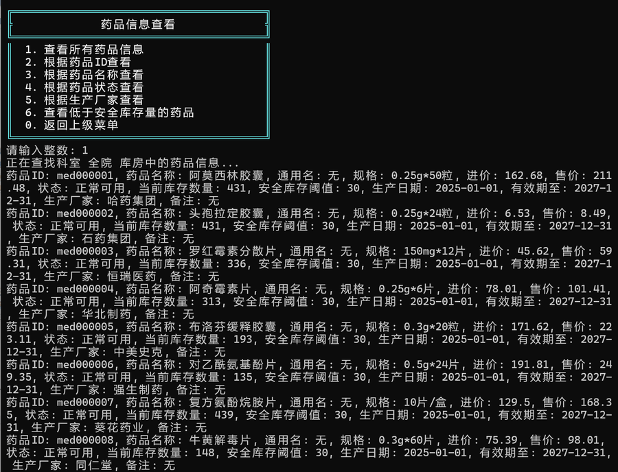 
  <em>▲ 药品列表截图</em>

  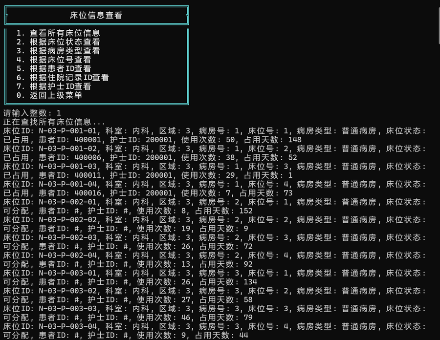 
  <em>▲ 床位列表截图</em>

### 6. 操作日志与紧急保存

`LogManager` 单例（`UI.cpp`）用于记录关键操作，支持 `info()`、`warn()`、`error()` 三个级别和结构化操作日志（`logOperation()`）。日志按日期写入 `Data/OperationLog/` 目录，文件名格式为 `his_YYYY_MM_DD.log`，采用互斥锁保证线程安全。

`main.cpp` 在程序启动后注册 `SIGINT`、`SIGABRT`、`SIGTERM` 信号处理函数。信号处理函数中调用 `emergencySave()`，遍历 12 个全局链表指针逐一写回文件。由于信号上下文中 `std::cin` 不安全，暂停提示使用 Windows `ReadFile` API。此外，主函数的 `try-catch` 异常捕获分支中也调用 `emergencySave()`，尽量保证程序中途退出时仍能将内存链表中的数据写回文件。

  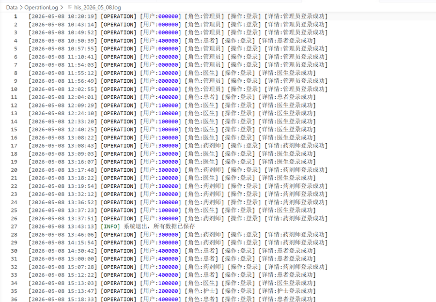 
  <em>▲ 操作日志文件截图</em>

  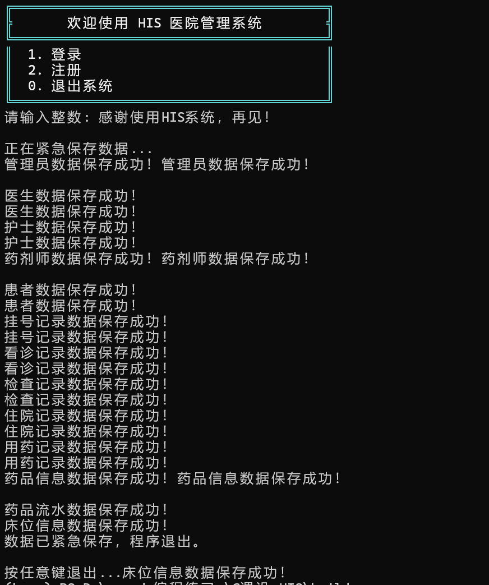 
  <em>▲ 异常保存/退出保存截图</em>

### 7. 管理端统计报表

管理员可查看科室统计总览、医生工作量统计、患者就诊统计、床位使用率统计和药品库存统计。报表直接基于当前链表遍历汇总，按科室或全院维度展示人员数量、业务数量、床位占用率、库存状态和费用统计结果。

   
  <em>▲ 科室统计总览</em>

  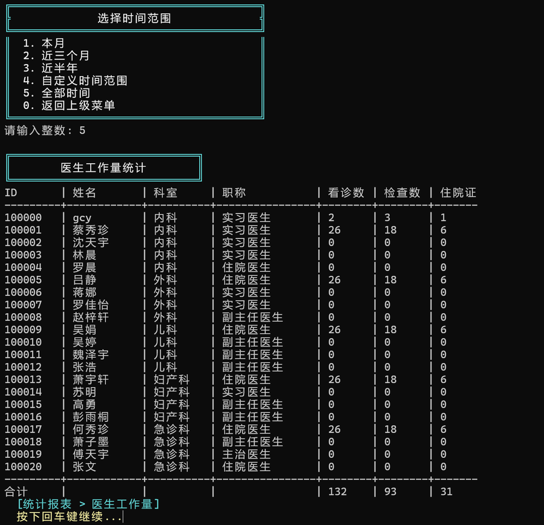 
  <em>▲ 医生工作量统计</em>

  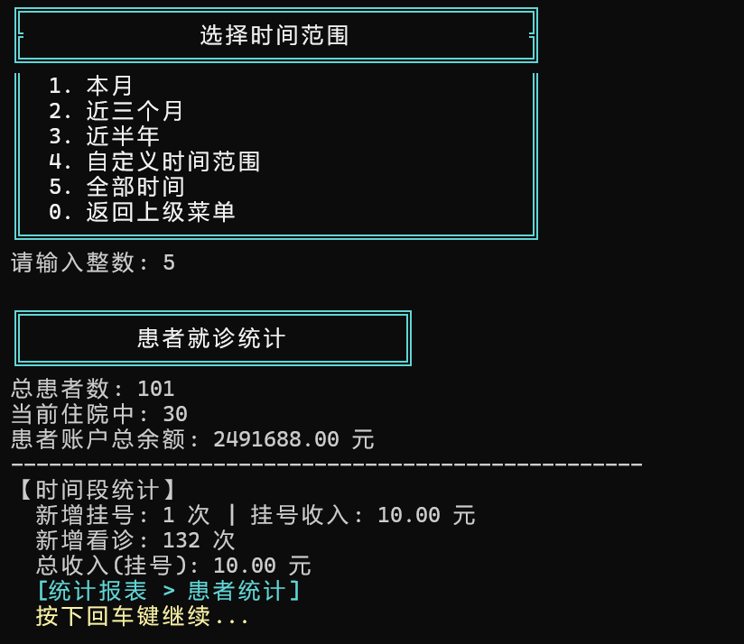 
  <em>▲ 患者就诊统计</em>

  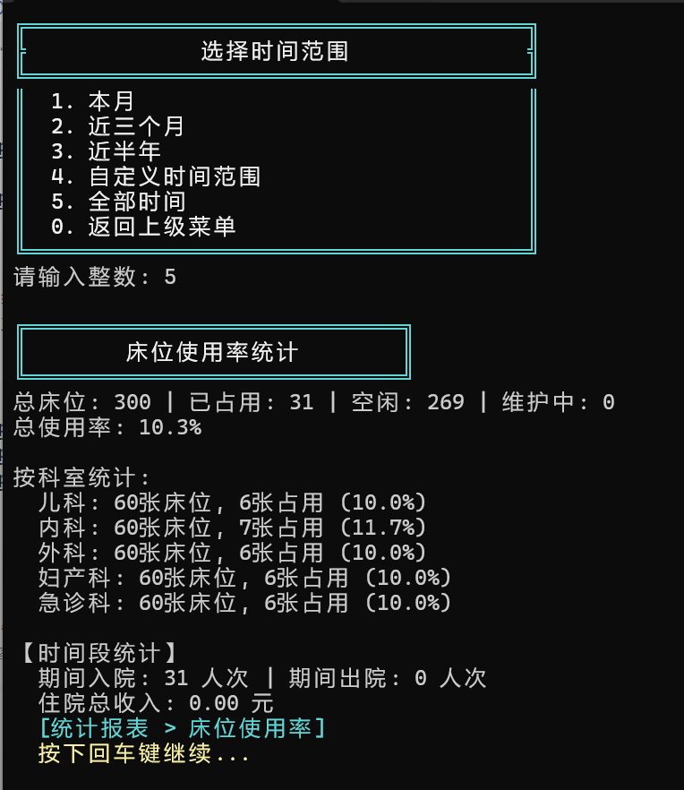 
  <em>▲ 床位使用率统计</em>

   
  <em>▲ 药品库存统计</em>

---

## III. 程序完整功能详述

### 1. 启动、注册与登录

程序启动后首先设置控制台编码为 UTF-8（`SetConsoleOutputCP(CP_UTF8)`），然后依次调用各 `loadXxxData()` 函数加载所有数据文件到内存双向链表。若管理员链表为空，系统提示必须先注册管理员账户（管理员注册需验证 API Key："88888888"）。随后进入登录/注册主菜单，用户可选择登录、注册或退出系统。

注册时，系统根据用户选择的角色生成不同前缀的 6 位用户 ID，并采集姓名、性别、年龄、电话、邮箱、科室、职称或等级等必要信息。密码经过加盐哈希后保存。登录时，系统根据角色和 ID 在对应链表中查找账户，校验密码（SHA-256 恒时比较）、逻辑删除标志和账户锁定状态。登录成功后进入相应角色主菜单，退出角色菜单后回到登录/注册主菜单。

   
  <em>▲ 首次启动创建管理员截图</em>

   
  <em>▲ 点击登录/注册后进入角色选择菜单截图</em>

   
  <em>▲ 选择角色后进入 ID 验证和密码验证截图（以选择管理员为例）</em>

### 2. 管理员功能

管理员主菜单包含账户管理、医疗记录管理、药品管理、床位管理、管理员信息管理、个人信息管理、账号封锁管理和统计报表八类功能。

**账户管理**可按"全院"或指定科室管理医生、护士、药剂师、患者和管理员信息。管理员可查看列表、按 ID 查询、添加新账户、修改账户字段和逻辑删除账户。不同角色的可修改字段与其结构体字段一致，例如医生包含科室、职称、擅长方向、排班信息和工作量计数，患者包含身份证号、地址、紧急联系人、过敏史、既往病史、账户余额和就医次数等。底层通过 `Login.h` 中的模板函数 `AccountManageGeneric<UserType>()` 统一处理各角色链表的增删改查。

**医疗记录管理**包括挂号记录、看诊记录、检查记录、住院记录和用药记录。管理员可查看、添加、修改状态或内容、删除记录，并可按科室、状态、患者 ID、医生 ID、护士 ID、药剂师 ID 或记录 ID 等条件筛选。记录删除均通过 `isDeleted` 标志实现，不会物理删除数据。

**药品管理**包括药品信息维护（名称、规格、进价、售价、库存、安全库存、生产日期、有效期、厂家、备注、通用名、别名、状态）和药品流水管理（入库/出库数量、操作人、原因、时间、备注）。

**床位管理**用于维护床位链表（状态、病房类型、科室、区域号、病房号、床位号、备注、绑定患者、绑定护士、使用次数、占用天数），床位编号由科室首字母 + 区域-病房类型-病房号-床位号自动组合生成。

**账号封锁管理**使用 `Login.h` 中的模板函数 `AccountManageGeneric<UserType>()` 统一处理五类角色账户状态。管理员可查看账户是否可用，并对账户执行激活（重置 `loginAttempts`）或封锁操作。

**统计报表**包含科室统计总览、医生工作量统计、患者就诊统计、床位使用率统计和药品库存统计，直接基于当前链表遍历汇总。

   
  <em>▲ 管理员主菜单截图</em>

   
  <em>▲ 管理员账户管理菜单截图</em>

   
  <em>▲ 管理员医疗记录管理菜单截图</em>

   
  <em>▲ 管理员药品管理菜单截图</em>

   
  <em>▲ 管理员床位管理菜单截图</em>

  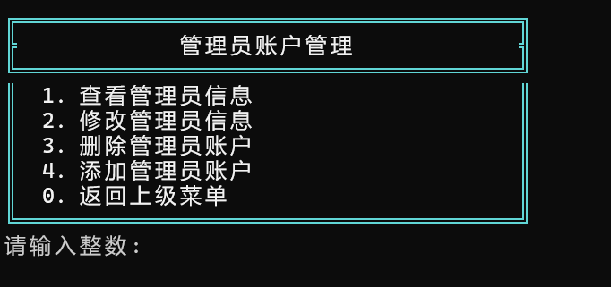 
  <em>▲ 管理员信息管理菜单截图</em>

  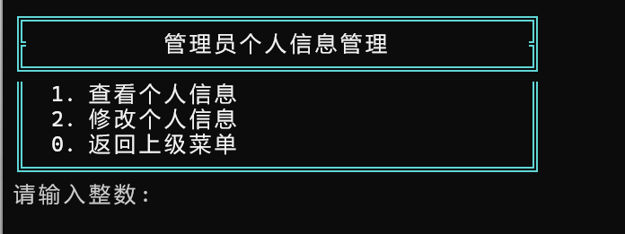 
  <em>▲ 管理员个人信息管理菜单截图</em>

   
  <em>▲ 管理员账号封锁管理菜单截图</em>

  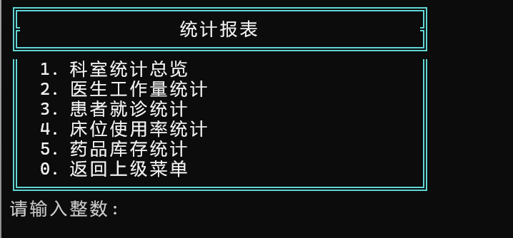 
  <em>▲ 管理员统计报表菜单截图</em>

### 3. 医生功能

医生主菜单包含挂号管理、看诊管理、检查管理和个人信息管理。

- **挂号管理**：查看与本人相关的挂号记录，处理已缴费的待诊挂号，支持按状态和科室筛选。
- **看诊管理**：根据已缴费挂号创建看诊记录，内容包括主诉、现病史、既往史、家族史、初步诊断、检查项目列表（通过 `examinationlist` 链表存储）、处方药品明细（通过 `prescriptions` 链表存储 `Prescription` 结构体，含药品 ID、名称、数量、剂量、频次、疗程、备注）、处方审核标志、是否建议住院和看诊状态。支持对已有看诊记录进行修改和补充。
- **检查管理**：根据看诊记录创建检查记录（`createExaminationByConsultation()`），并维护检查项目、报告、报告摘要、附件、备注和检查状态。支持按状态（已开单/已缴费/进行中/已完成/已报告/已作废）和科室筛选。
- **个人信息管理**：查看、修改医生个人资料（科室、职称、擅长方向、排班信息等）并修改密码。

   
  <em>▲ 医生主菜单截图</em>

   
  <em>▲ 医生挂号记录管理菜单截图</em>

   
  <em>▲ 医生查看当前的挂号记录截图</em>

   
   
  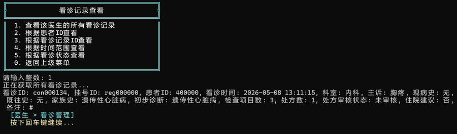 
  <em>▲ 医生根据挂号记录创建看诊记录截图</em>

   
  <em>▲ 医生看诊记录管理菜单截图</em>

  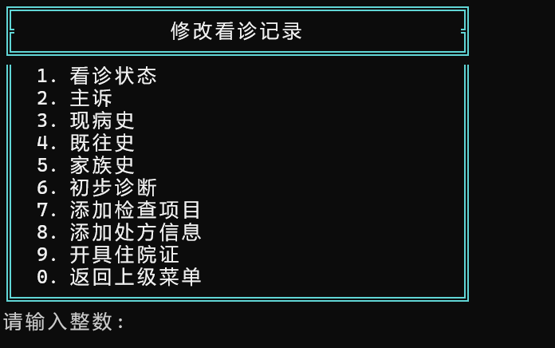 
  <em>▲ 医生修改看诊记录截图</em>

   
  <em>▲ 医生根据就诊状态的看诊记录创建检查记录截图</em>

   
  <em>▲ 医生个人信息管理菜单截图</em>

### 4. 护士功能

护士主菜单包含检查管理、住院管理、床位管理和个人信息管理。

- **检查管理**：查看和维护本科室相关检查记录，修改检查状态、报告、报告摘要、附件和备注。支持查看和更新检查关联的生命体征信息（`VitalSigns` 结构体，包含体温、血压、心率、呼吸率、血氧饱和度、身高、体重、BMI、疼痛评分、腰围、血糖、体脂率、尿酸、胆固醇等 15 项指标）。
- **住院管理**：根据医生的住院建议（`isHospitalizationRecommended = true`）创建住院记录，完成护士分配、床位分配（`assignBed()`）、床位调整（`transferBed()`，释放旧床位并占用新床位）、出院办理（`dischargePatient()`，记录出院时间、计算住院费用）和押金设置。
- **床位管理**：维护本科室床位信息（`bedInfo` 链表），查看床位占用状态，并可录入或更新床位关联的生命体征信息。
- **个人信息管理**：查看、修改护士个人资料并修改密码。

   
  <em>▲ 护士主菜单截图</em>

   
  <em>▲ 护士住院记录管理菜单截图</em>

   
  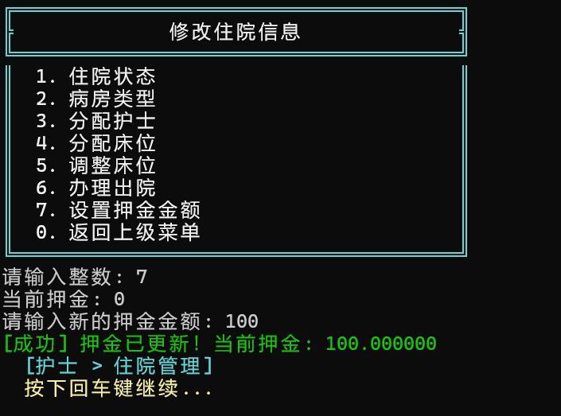 
  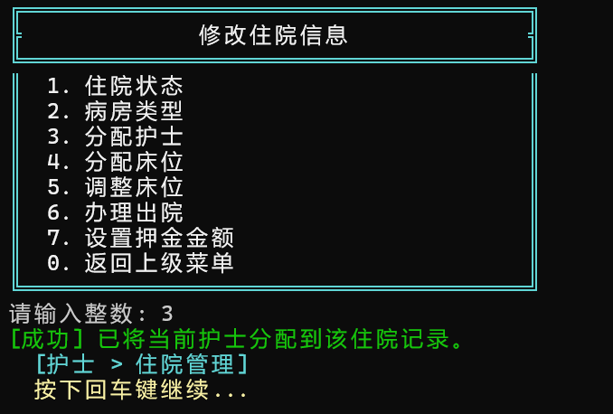 
   
  <em>▲ 护士根据住院证创建住院记录截图</em>

  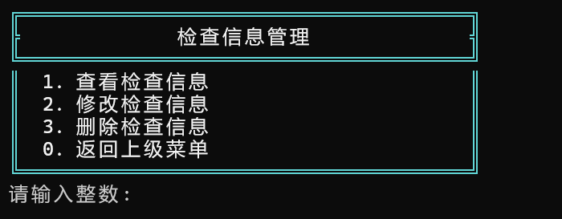 
  <em>▲ 护士检查信息管理菜单截图</em>

  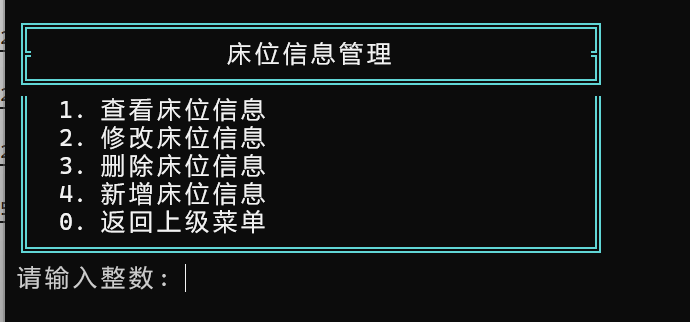 
  <em>▲ 护士床位管理菜单截图</em>

  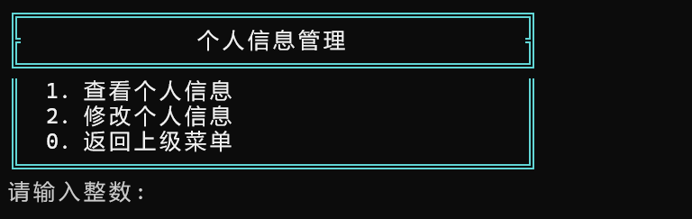 
  <em>▲ 护士个人信息管理菜单截图</em>

### 5. 药剂师功能

药剂师主菜单包含用药记录管理、药品管理和个人信息管理。

- **处方审核**：药师可查看看诊记录中的处方内容（药品名称、数量、剂量、频次），进行审核操作。审核状态包括待审核、已驳回、已通过、已取消。
- **用药记录管理**：根据已审核通过看诊记录中的处方创建用药记录（`addMedicationRecord()`），生成以 `mrd` 开头的用药记录 ID。可查看药品明细（`MedicationLine` 链表：药品 ID、名称、数量、单价、备注），添加或减少药品行（`addMedicationLine()` / `removeMedicationLine()`），并在患者完成缴费后执行发药操作（`dispenseMedicine()`）。发药时系统自动检查药品库存是否充足，并扣减相应数量，同时生成药品流水记录。
- **药品管理**：查看和维护药品信息（药品名称、规格、厂家、进价、售价、库存、安全库存、有效期、通用名、别名和状态），进行库存增加（入库）或减少（出库）操作。出入库操作均生成对应的药品流水记录（`MedicineFlow`，记录类型、数量、操作人、原因、时间）。
- **个人信息管理**：查看、修改药剂师个人资料并修改密码。

   
  <em>▲ 药剂师主菜单截图</em>

   
   
  <em>▲ 药剂师审核看诊记录中的处方截图</em>

   
  <em>▲ 药剂师用药记录管理截图</em>

   
  <em>▲ 药剂师发药截图</em>

   
  <em>▲ 药剂师药品管理截图</em>

  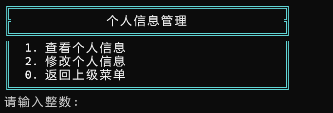 
  <em>▲ 药剂师个人信息管理菜单截图</em>

### 6. 患者功能

患者主菜单包含预约挂号、看诊记录、检查记录、用药记录、住院信息和个人信息管理等功能。

- **预约挂号**：选择科室和医生创建挂号记录（`appointRegistration()`），生成以 `reg` 开头的挂号 ID。可从账户余额中缴纳挂号费（`payRegistrationFee()`），也可撤回未缴费的挂号（`cancelRegistration()`）。挂号费根据所选医生的职称自动计算。
- **看诊记录**：查看本人所有看诊记录，包括主诉、诊断、处方内容和检查项目列表。
- **检查记录**：查看本人检查记录，对未缴费的检查通过余额完成缴费（`payExaminationFee()`）。缴费后检查状态从 ORDERED 变为 PAID，护士和医生可以继续处理。
- **用药记录**：查看本人用药记录和处方明细，对已审核的用药记录通过余额缴费（`payMedicationFee()`）。缴费后药剂师可执行发药操作。
- **住院信息**：查看本人住院记录，缴纳住院押金（`payHospitalizationDeposit()`），查看住院费用明细，并可申请出院（`applyForDischarge()`）。
- **个人信息管理**：维护联系方式、地址、病史、紧急联系人、过敏史等个人资料，支持账户充值和密码修改。

   
  <em>▲ 患者主菜单截图</em>

   
  <em>▲ 患者预约挂号截图</em>

   
  <em>▲ 患者挂号费用缴纳截图</em>

   
   
   
  <em>▲ 患者检查、用药、住院费用缴纳截图</em>

### 7. 数据文件与运行维护

系统数据文件分为用户数据和业务记录数据两大类。用户数据包括管理员、医生、护士、药剂师、患者；业务记录包括挂号、看诊、检查、住院、床位、用药、药品和药品流水。文本字段为空时统一保存为 `"#"` 占位符。

嵌套数据（如看诊记录中的处方、附件、检查项目列表、药品别名、关联记录 ID 列表等）采用附加行保存，行首带有标记前缀：`PRESCRIPTION:`、`ATTACHMENT:`、`EXAMINATION_ITEM:`、`ALIAS:`、`RELATED_REGISTRATION_ID:`、`MEDICATION_LINE:` 等。`VITAL_SIGNS:` 行采用分号分隔的键值对格式存储 15 项生命体征数据。每条记录的最后一行固定为 `count:N`，保存该类型记录的当前 ID 计数器值（如 `registrationCount`、`consultationCount` 等）。

程序正常退出时会依次保存各条链表并释放动态分配的链表节点。异常退出（Ctrl+C、信号触发）时通过 `emergencySave()` 尽可能保证数据不丢失。

   
  <em>▲ Data/ 目录结构截图</em>

   
  <em>▲ txt 数据文件内容截图</em>

---

## IV. 测试与验证

本系统未引入专门的自动化测试框架，测试主要通过终端菜单手动完成。测试时从 `build/` 目录运行程序，并观察菜单输出、数据文件变化和日志文件记录是否符合预期。

### 1. 管理员首次启动与账户锁定测试

| 测试步骤 | 预期结果 | 实际结果 |
|---------|---------|---------|
| 清空或准备无管理员数据的环境后启动程序 | 系统提示必须先创建管理员账户 | 符合预期 |
| 注册管理员后重新进入主菜单 | 管理员链表中产生 0 开头的 6 位 ID | 符合预期 |
| 使用错误密码连续登录 5 次 | 账户被锁定，不能继续登录 | 符合预期 |
| 由其他管理员进入账号封锁管理激活账户 | 账户状态恢复为可登录 | 符合预期 |

   
  <em>▲ 首次启动注册管理员截图</em>

   
   
  <em>▲ 账户锁定与激活截图</em>

### 2. 挂号 → 看诊 → 检查 → 用药完整流程测试

| 测试步骤 | 预期结果 | 实际结果 |
|---------|---------|---------|
| 患者选择科室和医生创建挂号记录 | 生成 `reg` 开头的挂号 ID，状态为 BOOKED | 符合预期 |
| 患者缴纳挂号费 | 账户余额扣减，挂号记录状态变为 PAID | 符合预期 |
| 医生根据已缴费挂号创建看诊记录 | 生成 `con` 开头的看诊 ID，关联挂号 ID | 符合预期 |
| 医生添加检查项目并创建检查记录 | 生成 `exa` 开头的检查 ID，按项目计算费用 | 符合预期 |
| 药剂师根据处方创建并审核用药记录 | 生成 `mrd` 开头的用药 ID，审核状态更新 | 符合预期 |
| 患者缴纳药费后药剂师发药 | 发药状态更新，药品库存扣减 | 符合预期 |

   
  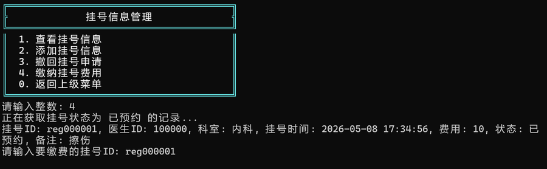 
  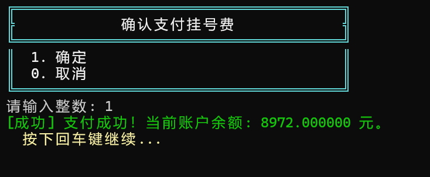 
  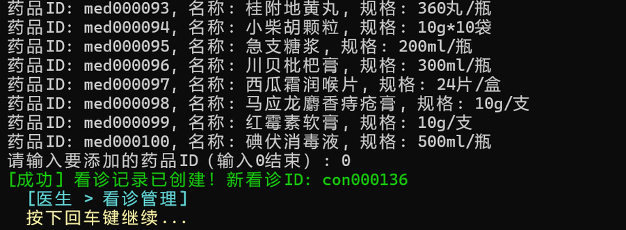 
  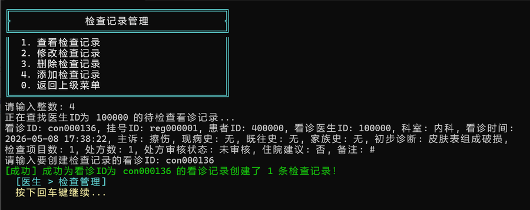 
  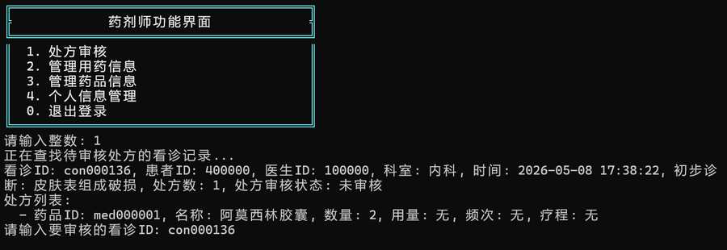 
   
   
  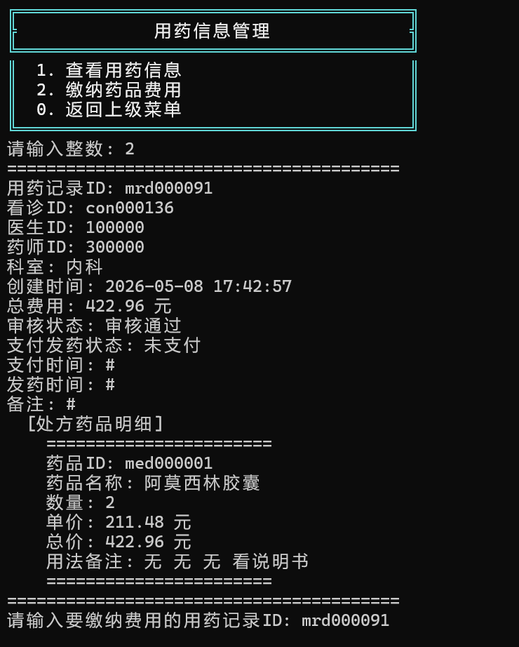 
  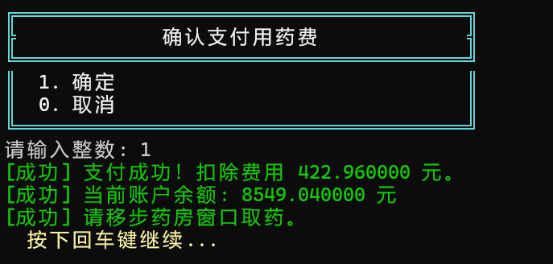 
  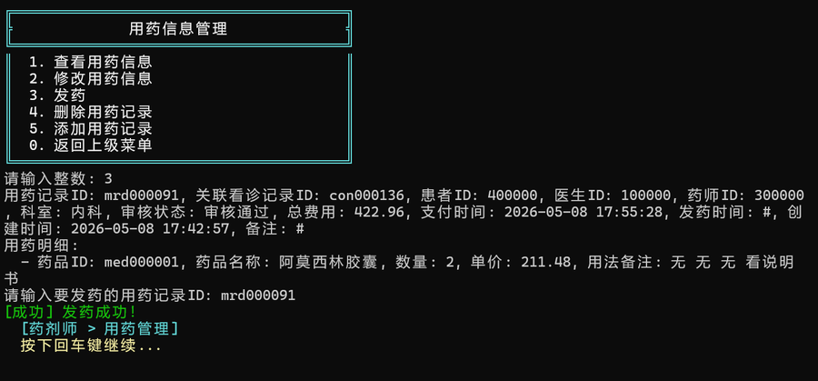 
  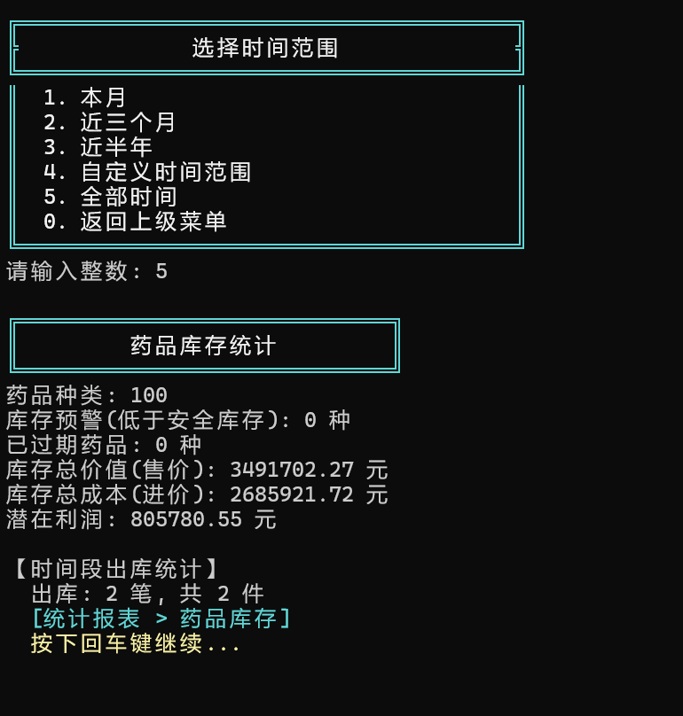 
  <em>▲ 挂号到用药完整流程测试截图</em>

### 3. 住院与床位管理测试

| 测试步骤 | 预期结果 | 实际结果 |
|---------|---------|---------|
| 医生在看诊记录中设置住院建议 | 看诊记录保存住院建议字段 | 符合预期 |
| 护士根据住院建议创建住院记录 | 生成 `hos` 开头的住院 ID | 符合预期 |
| 护士为患者分配床位 | 床位状态变为占用，并绑定患者与护士 | 符合预期 |
| 护士调整床位 | 原床位释放，新床位变为占用 | 符合预期 |
| 护士办理出院 | 记录出院时间，床位恢复可用，按病房类型×天数计算住院费用 | 符合预期 |

  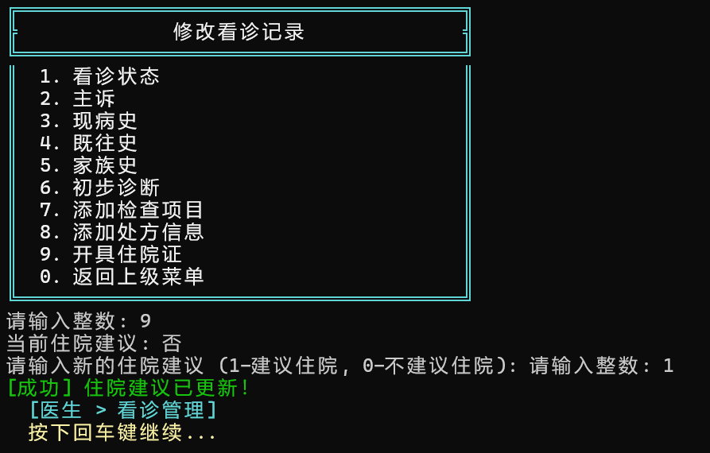 
  <em>▲ 医生设置住院建议截图</em>

   
  <em>▲ 住院记录创建截图</em>

  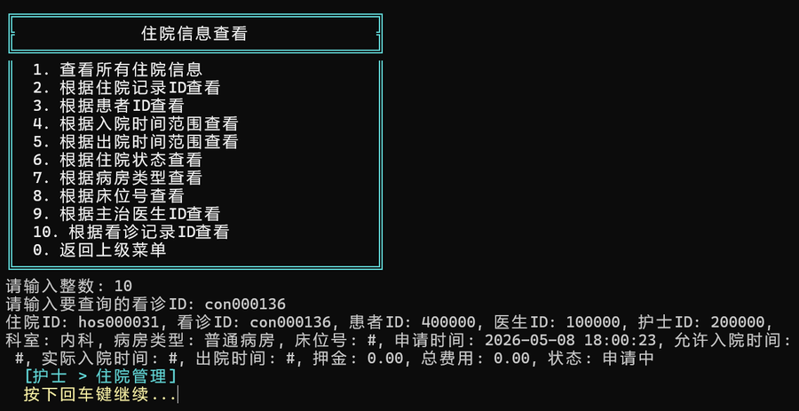 
  <em>▲ 住院记录详情截图</em>

  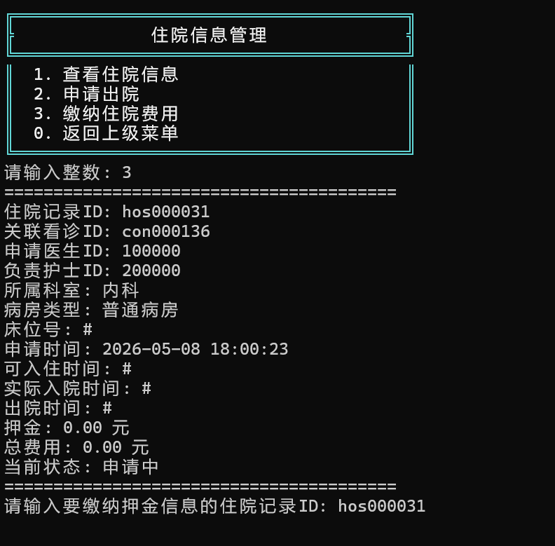 
   
  <em>▲ 患者住院缴费截图</em>

   
   
  <em>▲ 床位分配与调整截图</em>

   
  <em>▲ 出院办理截图</em>

### 4. 药品库存与流水测试

| 测试步骤 | 预期结果 | 实际结果 |
|---------|---------|---------|
| 管理员添加药品信息 | 生成 `med` 开头的药品 ID，写入药品链表 | 符合预期 |
| 管理员/药剂师进行入库操作 | 库存增加，生成入库流水记录 | 符合预期 |
| 药剂师发药 | 用药记录发药状态更新，库存扣减，生成出库流水 | 符合预期 |

  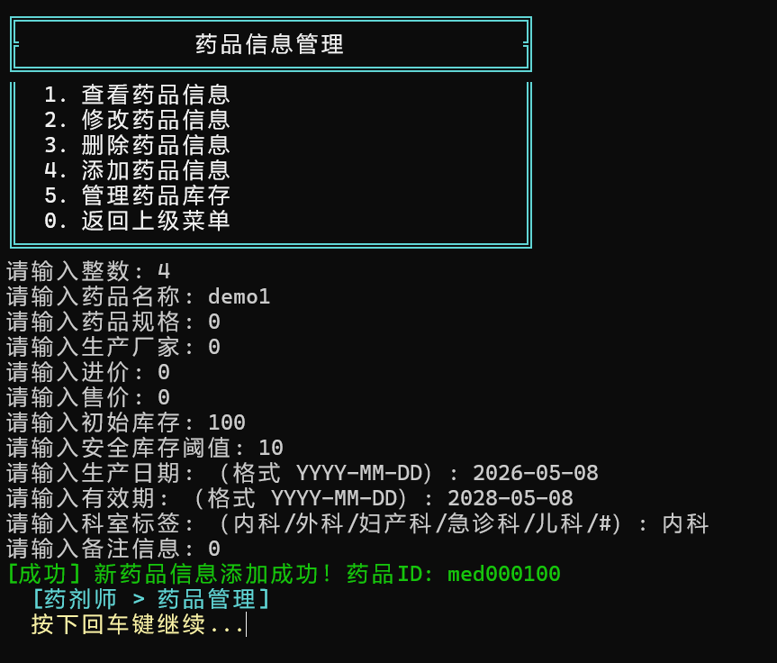 
  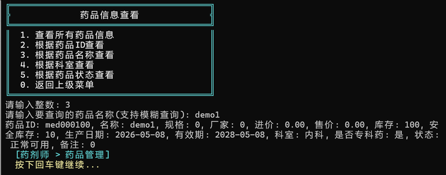 
  <em>▲ 创建药品截图</em>

  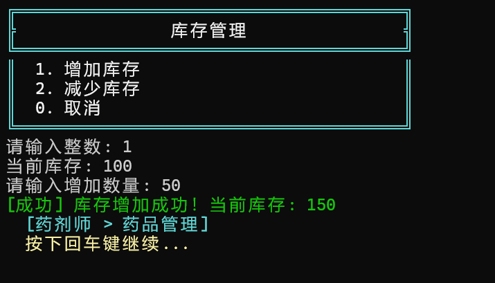 
   
  <em>▲ 药品入库与出库截图</em>

### 5. 非法输入拦截测试

| 测试步骤 | 预期结果 | 实际结果 |
|---------|---------|---------|
| 菜单选项输入字母或越界数字 | 提示重新输入，不进入错误分支 | 符合预期 |
| 金额、库存、年龄等输入负数或非数字 | 提示格式错误并要求重新输入 | 符合预期 |
| 普通字符串输入英文逗号或中文逗号 | 提示不能输入逗号，避免破坏文本字段分隔 | 符合预期 |
| 用户 ID 输入非 6 位数字或首位不在 0-4 范围 | 提示 ID 格式错误 | 符合预期 |
| 记录 ID 输入错误前缀或错误位数 | 提示记录 ID 格式错误 | 符合预期 |
| 密码长度不足 8 位，或缺少数字/字母组合 | 提示密码不符合规则 | 符合预期 |

  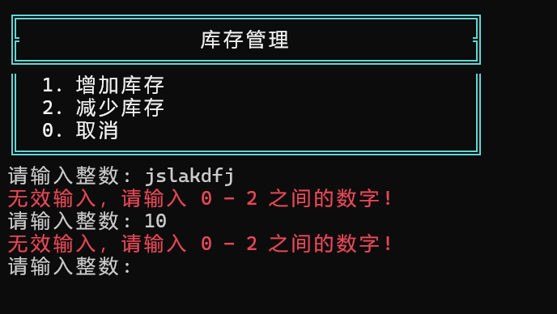 
  <em>▲ 非法菜单输入截图</em>

  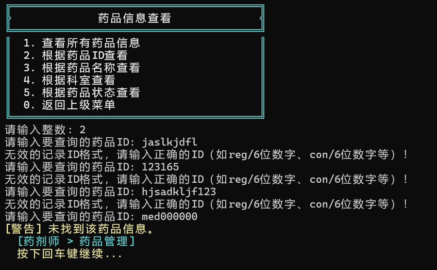 
  <em>▲ 非法 ID 输入截图</em>

### 6. 数据持久化、退出保存与日志测试

| 测试步骤 | 预期结果 | 实际结果 |
|---------|---------|---------|
| 新增一条挂号记录后正常退出程序 | `registrations.txt` 中保存该记录 | 符合预期 |
| 重新从 `build/` 目录启动程序 | 能重新读取并显示该挂号记录 | 符合预期 |
| 新增数据后使用 Ctrl+C 中断程序 | 触发紧急保存提示并写回数据文件 | 符合预期 |
| 执行登录、注册、修改等关键操作 | `Data/OperationLog/` 下按日期记录日志 | 符合预期 |

   
  <em>▲ 正常退出保存截图</em>

   
  <em>▲ 操作日志截图</em>

---

## V. 总结

本次课程设计完成了一个以 C++17 编写的控制台医院信息管理系统。程序使用面向对象思想组织五类用户，通过双向链表维护动态数据，通过 txt 文件完成持久化保存，并围绕挂号 → 看诊 → 检查 → 用药 → 住院 → 药品 → 床位 → 账户管理构建了较完整的业务流程。

**主要技术特点总结：**

| 技术点 | 实现方式 |
|-------|---------|
| 编程语言与标准 | C++17，仅依赖 C++ 标准库，无第三方外部依赖 |
| 数据结构 | 12 条双向链表（5 类用户 + 7 类业务记录），`LinkedList<T>` 模板支持嵌套集合 |
| 密码安全 | SHA-256 + 随机盐值 + 1000 次迭代 + 恒时比较，连续 5 次失败锁定账户 |
| ID 体系 | 6 位数字 ID，首位区分角色，后 5 位递增，业务记录 ID 带有类型前缀（reg/con/exa/mrd/hos/med/mfl） |
| 数据持久化 | 自定义 CSV 格式 + 嵌套数据附加行标记，逻辑删除（isDeleted）策略 |
| 输入校验 | 20+ 种校验函数，覆盖 ID、密码、金额、日期、科室、电话、邮箱、身份证号等 |
| 异常保护 | SIGINT/SIGABRT/SIGTERM 信号处理 + try-catch 异常捕获 + emergencySave 紧急保存 |
| 终端 UI | Unicode 双线框菜单 + CJK 宽度计算 + 彩色输出 + 分页显示 + 隐藏密码输入 |
| 操作审计 | LogManager 单例，按日期写入结构化操作日志 |
| 版本管理 | Git + CMake + DevelopLog.md 开发日志 |
