# 2024级《程序设计基础课程设计》总结报告（第2组）

提交日期：2026年5月XX日

## 报告正文

## I. 小组分工合作情况

本小组选择“小型医疗管理系统”作为课程设计题目，最终提交程序为 C++17 控制台交互程序。程序入口为 main.cpp，头文件集中在 Head/，实现文件集中在 Source/，运行数据以 txt 文本形式保存在 Data/ 目录下。系统通过终端菜单完成注册、登录、角色权限分发、医疗业务处理、数据保存和退出操作。

开发过程中，小组使用 Git 管理代码版本，并维护 DevelopLog.md 记录阶段性修改内容、已知问题和修复情况。组长负责总体架构、公共能力、管理员模块、登录安全、数据读写、终端交互、输入校验、日志和文档整理；组员负责医生、护士、药剂师和患者四类业务角色模块。两人通过统一的数据结构和 ID 关联规则完成联调。

构建方面，小组使用 CMake 描述控制台程序的编译规则，采用 C++17 标准。实际运行时需要先进入 build/ 目录，因为数据文件路径在代码中统一使用 ../Data/ 相对路径。如果从项目根目录直接运行，程序会找不到数据文件。

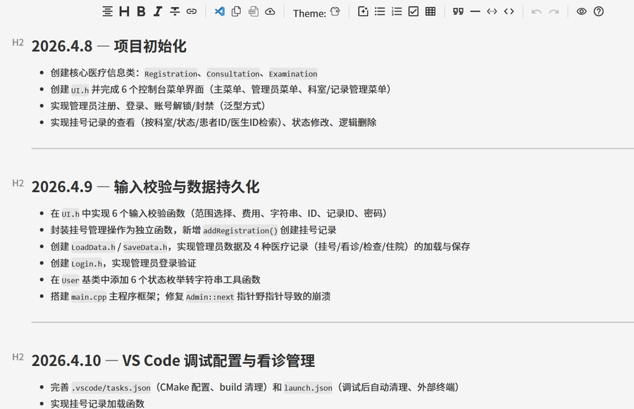{width=4.7in}

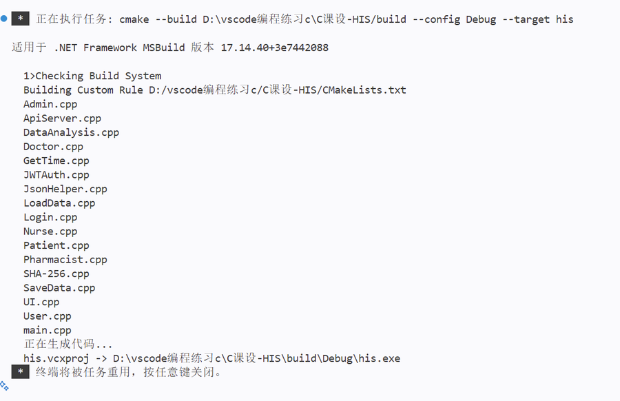{width=4.7in}

## II. 系统定位与运行方式

本系统面向小型医院或社区卫生服务场景，目标是用纯终端方式模拟医院信息管理中的核心业务。系统不依赖数据库，也不依赖外部包，所有业务对象在运行时以链表节点存在，退出时写入 txt 文件。这样的设计更贴合程序设计基础课程中对类、结构体、动态内存、链表、文件读写和异常处理的考查。

系统的运行入口是 main.cpp。程序启动后首先设置 Windows 控制台 UTF-8 编码，随后加载各类用户和业务记录，进入登录/注册主循环。用户登录后，main.cpp 根据角色选择调用管理员、医生、护士、药剂师或患者的菜单函数。角色退出后返回登录菜单，系统退出时统一保存所有链表数据。

第一次运行时，如果没有读取到管理员链表，程序会提示必须先创建管理员账号。这样可以保证后续医生、护士、药剂师、患者以及业务数据都有一个最高权限入口进行维护，避免系统在无管理员状态下进入不可管理状态。

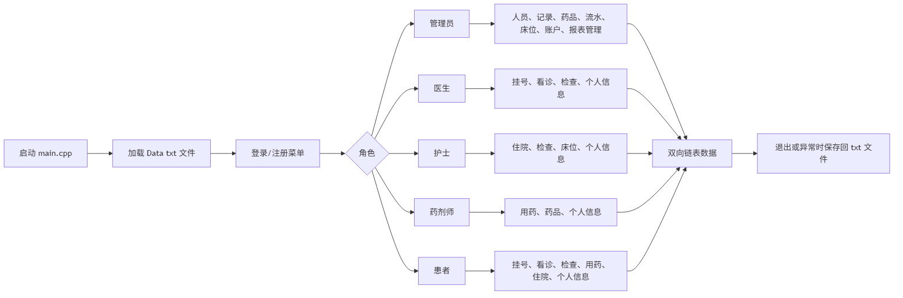{width=5.2in}

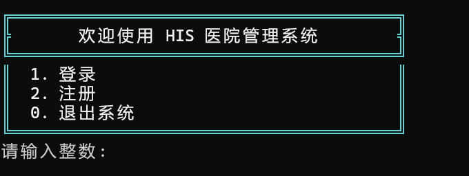{width=3.8in}

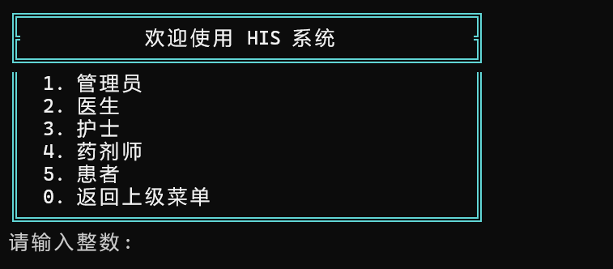{width=3.8in}

## III. 类层次与核心数据模型

系统设置管理员、医生、护士、药剂师、患者五类用户。五类用户都继承自 User 基类，User 中保存通用身份字段、密码哈希字段、账户状态字段、基础联系方式、状态转换函数和费用计算函数。这样做的好处是：登录、密码、账户锁定、基础信息、枚举转换、费用计算等公共能力只需要实现一次，各角色只扩展自己的业务字段和菜单操作。

Admin 类负责全局管理，包含人员、医疗记录、药品、床位、账号状态和统计报表等入口；Doctor 类负责挂号、看诊、检查和住院建议；Nurse 类负责检查结果、住院记录、床位分配、床位调整和出院办理；Pharmacist 类负责处方审核、用药记录、发药和药品库存维护；Patient 类负责挂号预约、缴费、记录查看、押金缴纳、账户充值和个人信息维护。

所有主要实体都采用双向链表组织。每个节点包含 prev 和 next 指针，新增数据时采用头插法，时间复杂度为 O(1)。删除时不直接释放节点，而是设置 isDeleted 标志进行逻辑删除，查询和保存时跳过已删除节点。这种方式降低了链表指针断裂风险，也便于后续排查数据变更。

一条主记录下存在多项子数据时，系统使用 LinkedList<T> 模板类进行嵌套管理。例如看诊记录中的检查项目列表、处方列表，用药记录中的药品明细，药品信息中的别名列表，都不再依赖固定长度数组，而是使用链式结构动态保存。

| 数据类别 | 主要结构 | 说明 |
| --- | --- | --- |
| 用户类 | Admin、Doctor、Nurse、Pharmacist、Patient | 五类角色均继承 User，共享认证、基础信息和公共工具函数 |
| 医疗记录 | Registration、Consultation、Examination、Hospitalization、MedicationRecord | 围绕挂号、看诊、检查、住院和用药形成业务闭环 |
| 资源信息 | Medicine、bedInfo | 保存药品库存、药品状态、床位状态、病房信息和绑定关系 |
| 嵌套集合 | LinkedList<T> | 用于处方、检查项目、用药明细、药品别名等动态子项 |

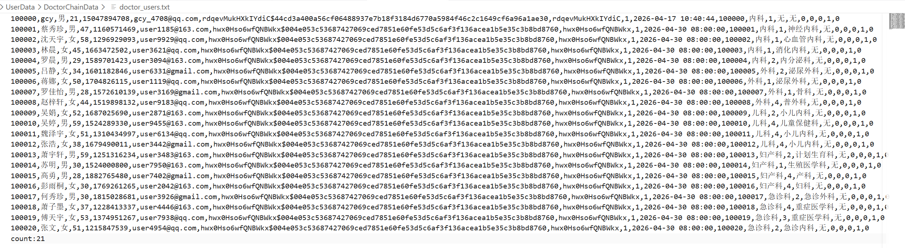{width=4.7in}

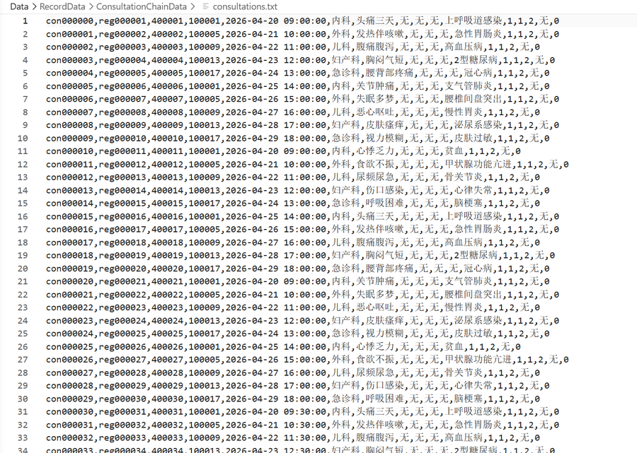{width=4.7in}

## IV. ID 体系、权限范围与费用规则

系统使用统一 ID 规则区分不同对象。用户 ID 为 6 位数字，首位表示角色：0 为管理员，1 为医生，2 为护士，3 为药剂师，4 为患者；后五位由对应角色计数器递增生成。业务记录则使用英文前缀加 6 位数字，例如 reg 表示挂号记录，con 表示看诊记录，exa 表示检查记录，hos 表示住院记录，mrd 表示用药记录，med 表示药品。

权限控制主要体现在查询和修改范围上。管理员可以从全院或指定科室视角维护系统数据；医生主要处理本人相关挂号、看诊和检查；护士主要处理本科室检查、住院和床位；药剂师处理本科室处方审核、用药记录和药品库存；患者只能查看和支付与本人相关的挂号、看诊、检查、用药和住院记录。

费用计算由 User 基类提供公共函数。挂号费按医生职称计算，检查费按检查项目计算，住院费按病房类型和住院天数计算。费用规则集中放在公共层，能保证患者缴费、管理员查看、医生或护士创建记录时使用同一套计费标准。

| 费用类型 | 计费依据 | 规则说明 |
| --- | --- | --- |
| 挂号费 | 医生职称 | 实习 10 元、住院 20 元、主治 30 元、副高 40 元、正高 50 元 |
| 检查费 | 检查项目 | 体温、血压、心率、血糖、血脂等项目按固定金额计费 |
| 住院费 | 病房类型 × 天数 | 普通、隔离、VIP、ICU 病房采用不同日费用标准 |

## V. 启动加载、注册登录与账号安全

程序启动阶段会依次调用 loadAdminData、loadDoctorData、loadNurseData、loadPharmacistData、loadPatientData 以及各类业务记录加载函数，把 txt 文件中的数据恢复为内存链表。各加载函数在解析数据时会设置 ID 计数器，保证后续新增记录不会和已有 ID 冲突。

注册时，系统根据用户选择的角色生成 ID，并采集姓名、性别、年龄、电话、邮箱、科室、职称或等级等信息。管理员注册需要额外验证 API Key，防止普通用户随意创建管理员账号。患者还会录入身份证号、地址、紧急联系人、过敏史和既往病史等就医信息。

登录安全是系统的重要特色。系统不保存明文密码，而是生成随机盐值，并使用 SHA-256 进行 1000 次迭代，最终保存为 salt$hash 格式。登录时重新计算哈希并进行逐字节异或比较。连续 5 次密码错误后，账户会被锁定，需要管理员通过账号封锁管理重新激活。

Login.h 中的 AccountManageGeneric<UserType>() 使用模板函数统一处理不同角色的账号激活和封锁。管理员选择角色后，系统展示该角色所有未删除账户及状态，再根据输入的用户 ID 执行激活或封锁操作。模板化处理减少了五类用户账户管理中的重复代码。

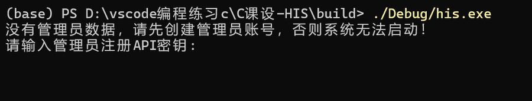{width=4.7in}

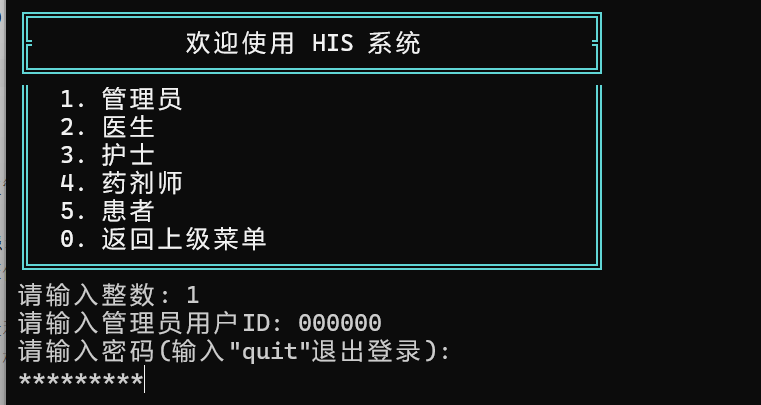{width=4.2in}

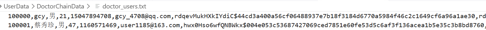{width=4.7in}

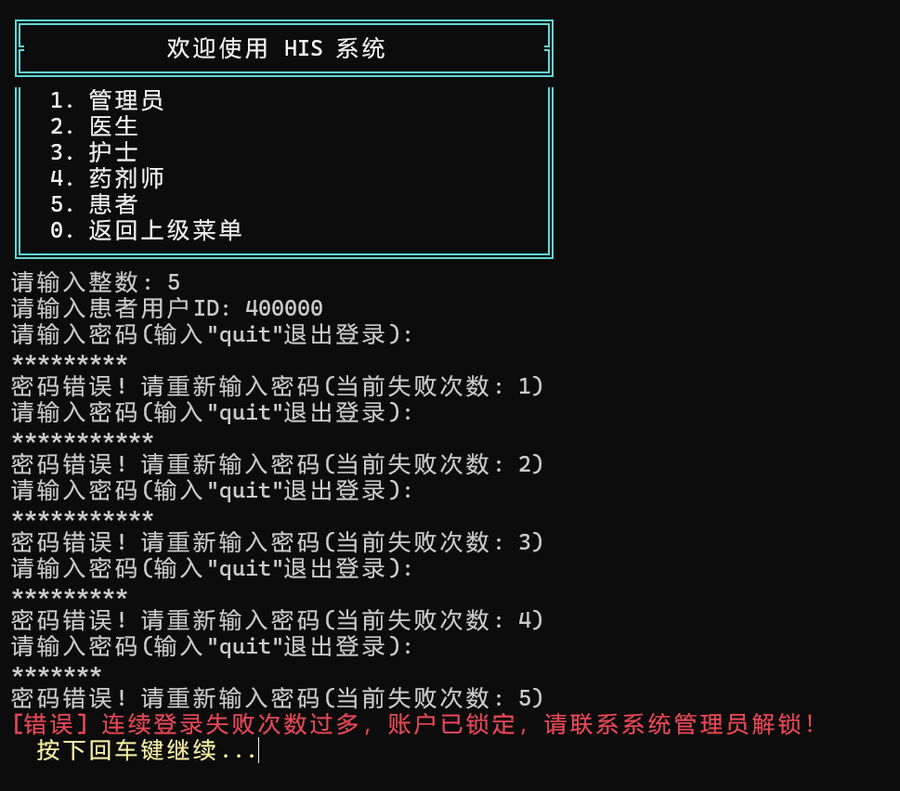{width=4.7in}

{width=4.7in}

## VI. 管理员模块设计

管理员模块是系统的全局维护入口。管理员主菜单包含账户管理、医疗记录管理、药品管理、床位管理、管理员信息管理、个人信息管理、账号封锁管理和统计报表。管理员进入大部分功能前可以选择“全院”或某个科室，从而控制后续查询和修改范围。

账户管理用于维护医生、护士、药剂师、患者和管理员信息。管理员可以查看全部记录、按 ID 查询、按姓名或状态筛选，也可以添加新账户、修改已有账户字段或逻辑删除账户。不同角色的字段不同，例如医生包含职称、擅长方向和排班信息，护士包含等级和护理统计，患者包含身份证号、地址、病史和余额。

医疗记录管理覆盖挂号、看诊、检查、住院和用药记录。管理员可以查看不同状态的记录，按患者 ID、医生 ID、护士 ID、药剂师 ID 或记录 ID 筛选，也可以在需要时修改状态或逻辑删除。管理员并不直接替代医生、护士、药剂师和患者完成所有业务，而是提供全局维护和异常修正能力。

药品管理用于维护药品基础信息，包括药品名称、规格、厂家、进价、售价、库存、安全库存、生产日期、有效期、所属科室、通用名、别名、状态和备注。药品库存变化最终与用药记录的发药状态相关联，不再单独维护库存变动实体。床位管理用于维护 bedInfo 链表，包括病房类型、科室、区域号、房号、床位号、状态、绑定患者、绑定护士和生命体征等。

统计报表基于当前内存链表遍历汇总。管理员可以查看科室统计总览、医生工作量统计、患者就诊统计、床位使用率统计和药品库存统计。药品库存统计中的用药数量来自已发药的用药记录，因此它体现的是处方发药后的实际库存影响。

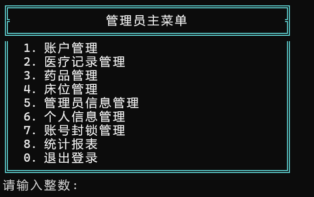{width=3.8in}

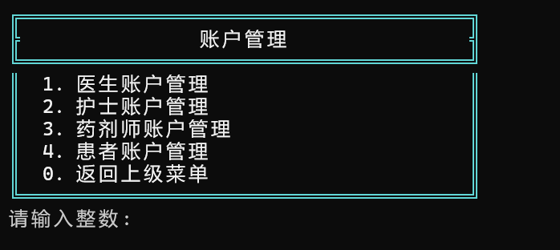{width=3.8in}

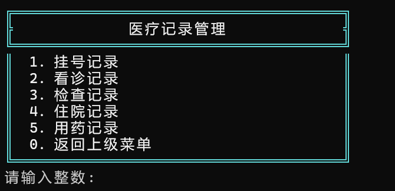{width=3.8in}

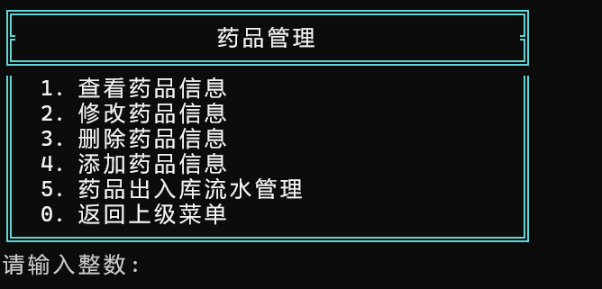{width=3.8in}

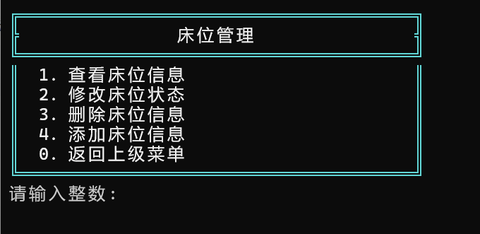{width=3.8in}

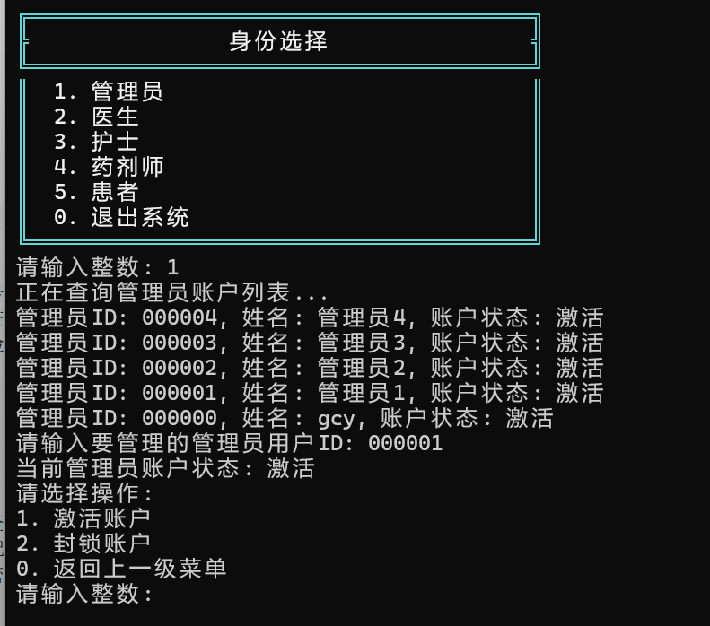{width=4.4in}

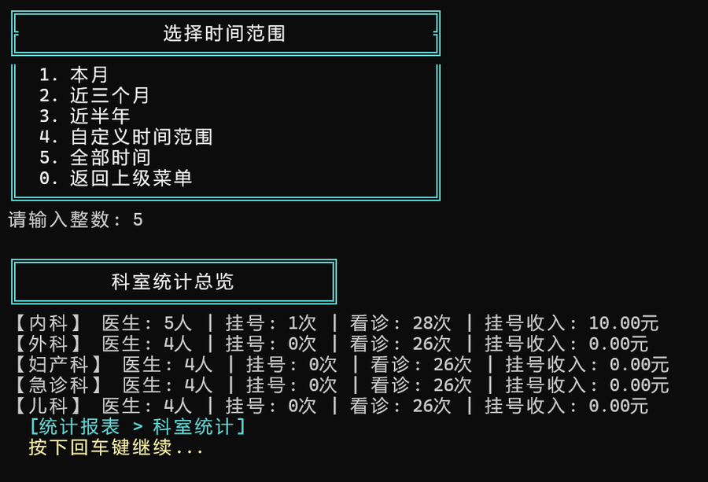{width=4.7in}

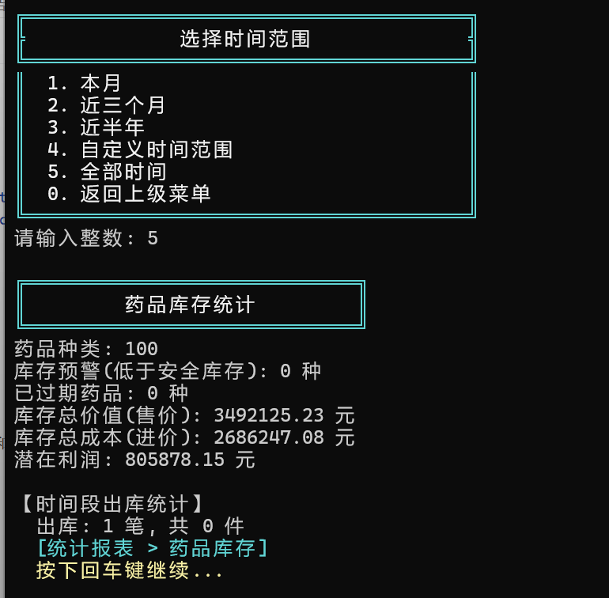{width=4.7in}

## VII. 医生模块设计

医生模块围绕挂号、看诊和检查展开。医生登录后只能处理与本人相关或本科室相关的记录，避免跨科室随意修改。医生可以查看挂号记录，按状态、患者 ID、时间范围或挂号 ID 查询，并对合适的挂号记录进行状态维护。

看诊是医生模块的核心。医生根据已缴费挂号创建看诊记录，系统生成 con 开头的看诊 ID，并关联挂号 ID、患者 ID、医生 ID 和科室。看诊记录中保存主诉、现病史、既往史、家族史、初步诊断、检查项目列表、处方列表、处方审核标志、住院建议和状态。

医生可在看诊记录中添加检查项目和处方。检查项目后续可以生成 Examination 记录，由患者缴费后继续处理；处方内容由药剂师审核，通过后转化为 MedicationRecord 用药记录。医生还可以设置住院建议，为护士后续创建住院记录提供依据。

医生个人信息管理包含姓名、性别、年龄、科室、职称、联系电话、邮箱、在岗状态、排班信息和密码修改等内容。医生职称还会影响患者挂号费用，因此职称字段不仅用于展示，也参与业务计算。

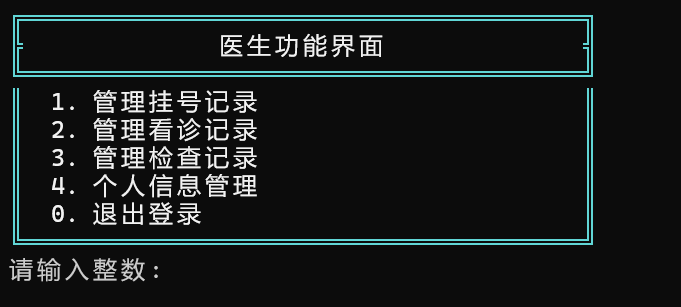{width=3.8in}

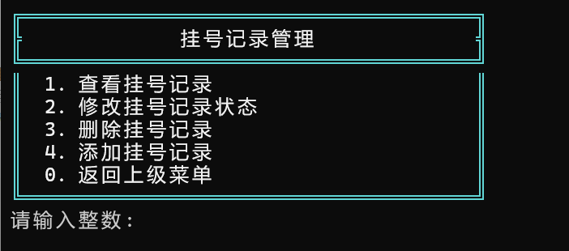{width=3.8in}

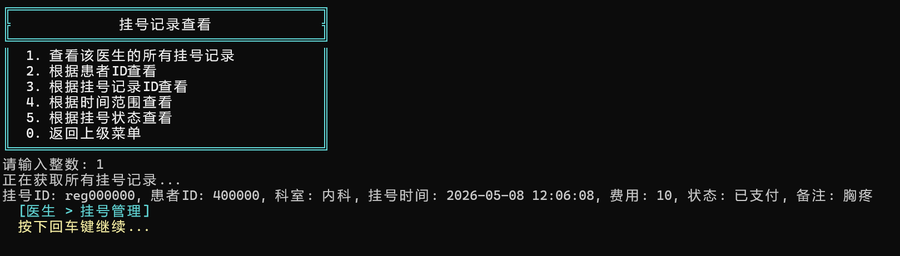{width=4.7in}

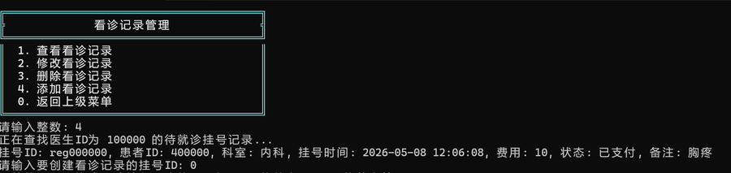{width=4.7in}

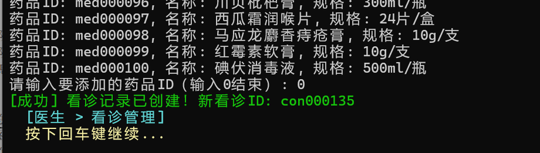{width=4.7in}

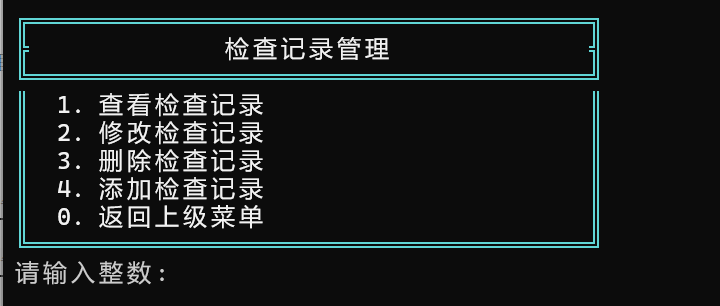{width=3.8in}

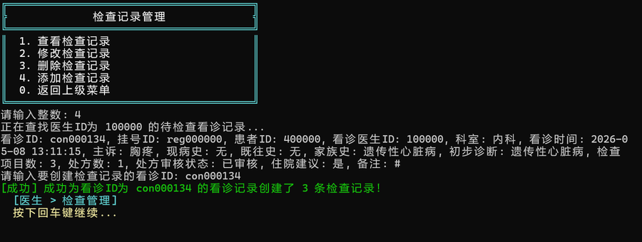{width=4.7in}

## VIII. 护士模块设计

护士模块主要处理检查记录、住院记录和床位信息。护士登录后按照科室筛选数据，查看本科室相关检查和住院记录，录入或修改检查结果、报告摘要、附件和备注。检查记录中包含 VitalSigns 生命体征结构体，可保存体温、血压、心率、呼吸频率、血氧、身高、体重、BMI、疼痛评分等信息。

住院管理由医生的住院建议触发。医生在看诊记录中设置住院建议后，护士可以据此创建住院记录，生成 hos 开头的住院 ID。住院记录关联看诊 ID、患者 ID、医生 ID、护士 ID、科室、病房类型、床位号、申请时间、入院时间、出院时间、押金、总费用和状态。

床位管理用于维护 bedInfo 链表。护士可以查看床位状态，分配床位、调整床位、办理出院，并在床位信息中绑定患者和护士。床位状态变化会与住院记录联动，例如分配床位后床位被占用，调整床位时原床位释放，新床位占用，出院后床位恢复可用。

住院费用由 User 基类中的住院费用计算函数处理，按病房类型和住院天数计算，不足一天按一天处理。这样护士办理出院时可以统一计算费用，并让患者侧查看和缴纳相关费用。

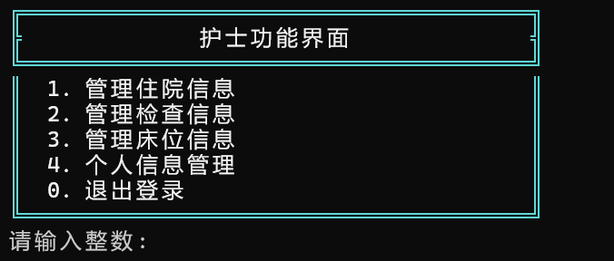{width=3.8in}

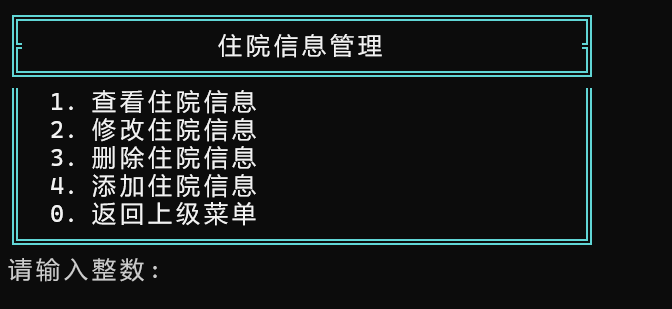{width=3.8in}

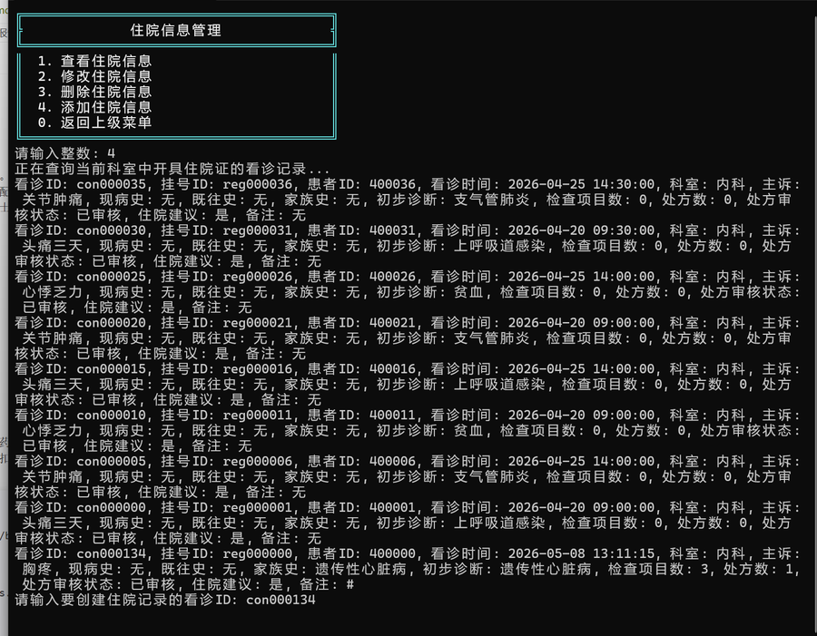{width=4.7in}

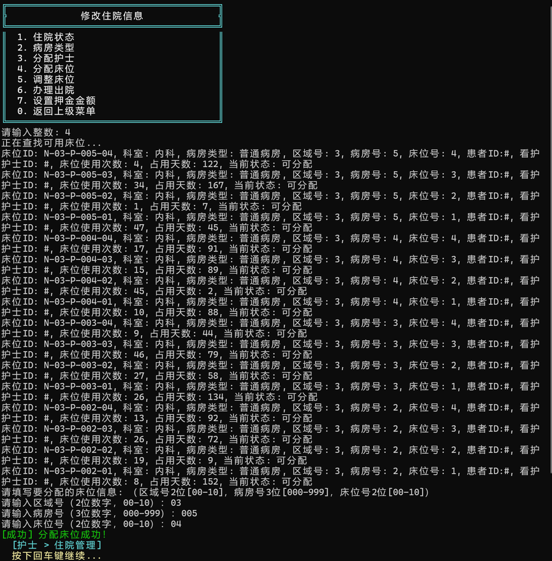{width=4.7in}

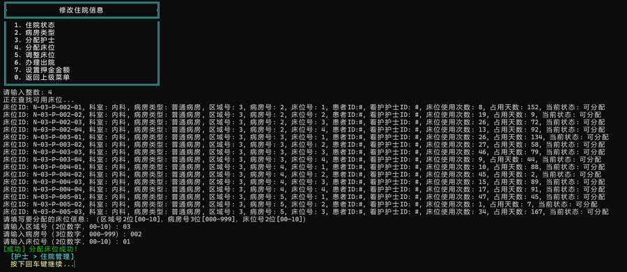{width=4.7in}

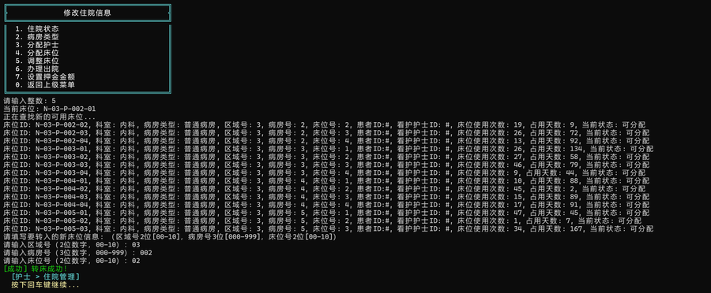{width=4.7in}

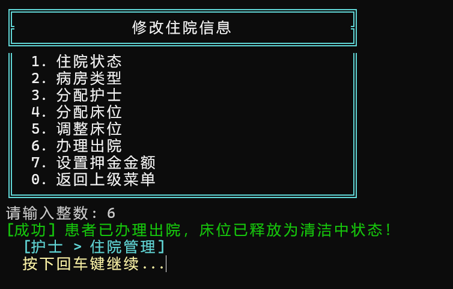{width=4.7in}

## IX. 药剂师、用药记录与药品库存设计

药剂师模块以 MedicationRecord 用药记录作为核心，所有处方审核、缴费、发药和库存扣减都围绕用药记录完成。这样可以避免同一发药行为在多个结构中重复保存，也能让用药记录同时承担处方明细、审核状态、支付状态、发药状态和费用统计的作用。

医生在看诊记录中开具处方后，药剂师可以审核处方。审核状态包括待审核、审核拒绝、审核通过和医生撤销。审核通过后，系统可以根据处方创建用药记录，生成 mrd 开头的用药记录 ID，并保存医生 ID、药剂师 ID、患者 ID、科室、创建时间、用药明细、总费用、支付时间、发药时间和备注。

用药明细由 MedicationLine 组成，每一行包含药品 ID、药品名称、数量、下单时单价和用法备注。患者缴纳药品费用后，用药记录状态从未缴费变为已缴费未发药；药剂师执行发药后，状态变为已发药，并扣减 Medicine 中的库存数量。库存低于安全库存或药品过期时，可以通过药品状态反映。

药品信息结构 Medicine 保存药品 ID、名称、规格、厂家、进价、售价、库存、安全库存、生产日期、有效期、所属科室、是否专科受限、通用名、别名列表、备注和状态。药剂师和管理员都可以查看药品信息，药剂师侧更强调处方审核、发药和库存可用性。

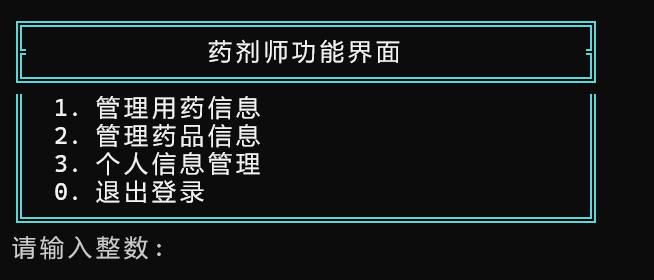{width=3.8in}

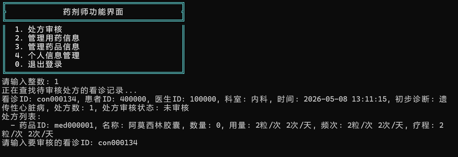{width=4.7in}

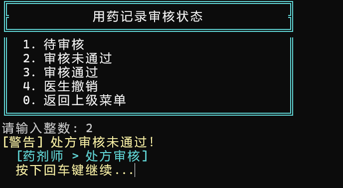{width=4.7in}

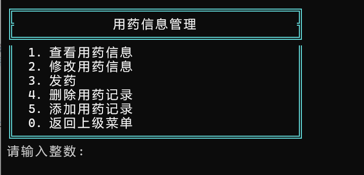{width=3.8in}

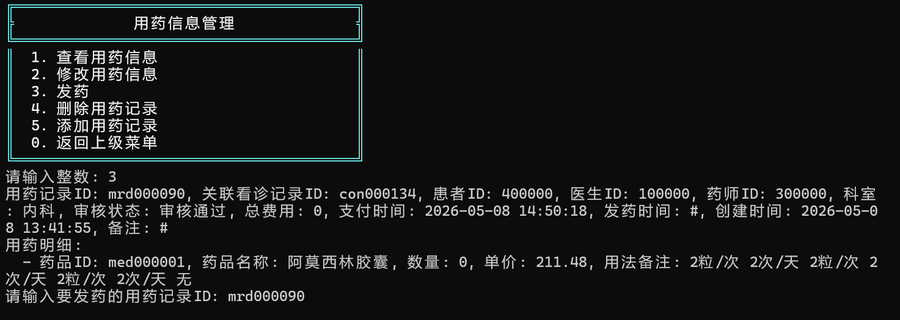{width=4.7in}

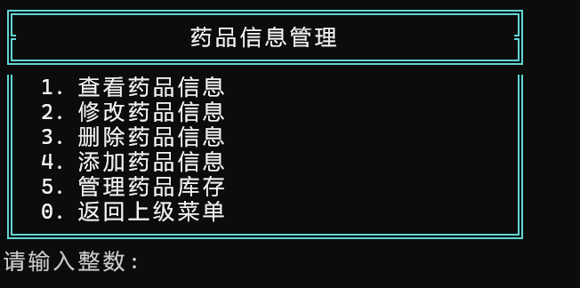{width=3.8in}

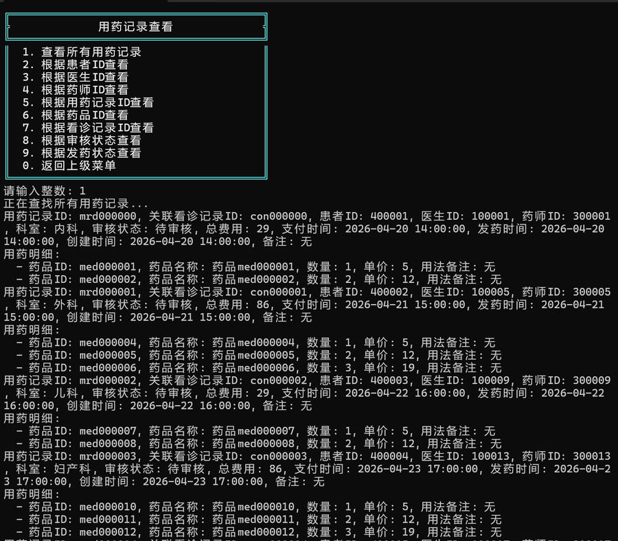{width=4.7in}

## X. 患者模块设计

患者模块从普通就诊者视角组织功能，包括预约挂号、查看看诊记录、查看检查记录、查看用药记录、查看住院信息和维护个人信息。患者账户中保存余额，缴纳挂号费、检查费、药品费和住院押金时都会从余额扣除，余额不足则不能完成支付。

预约挂号时，患者选择科室和医生，系统创建 Registration 记录，状态初始为已预约。患者缴纳挂号费后，挂号状态变为已支付，医生才能基于该挂号创建看诊记录。患者也可以撤回未缴费挂号，避免无效挂号占用医生资源。

患者可以查看本人所有看诊、检查、用药和住院信息。检查记录未缴费时，患者可以完成检查缴费；用药记录审核通过且未缴费时，患者可以缴纳药品费用；住院记录需要押金时，患者可以缴纳住院押金。患者不能修改医生诊断、护士记录或药剂师审核结果，只能查看和支付与本人相关的数据。

个人信息管理包括姓名、性别、年龄、身份证号、联系电话、邮箱、家庭住址、紧急联系人、过敏史、既往病史、婚姻状况、账户余额、住院状态和密码修改。患者信息字段较多，主要是为了让后续看诊、住院和用药记录能呈现更完整的就医背景。

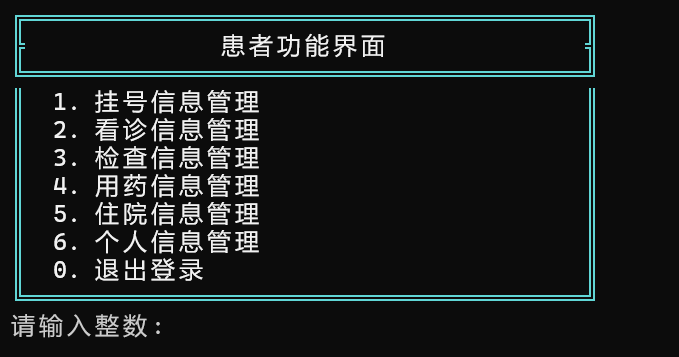{width=3.8in}

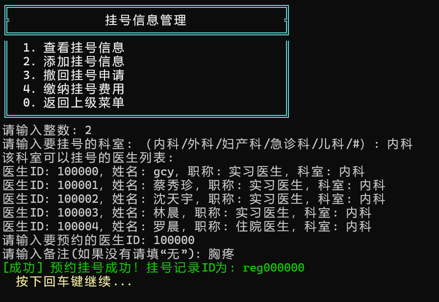{width=4.7in}

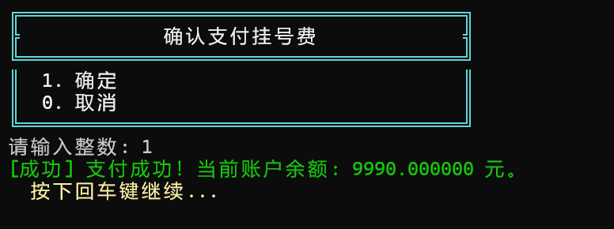{width=4.7in}

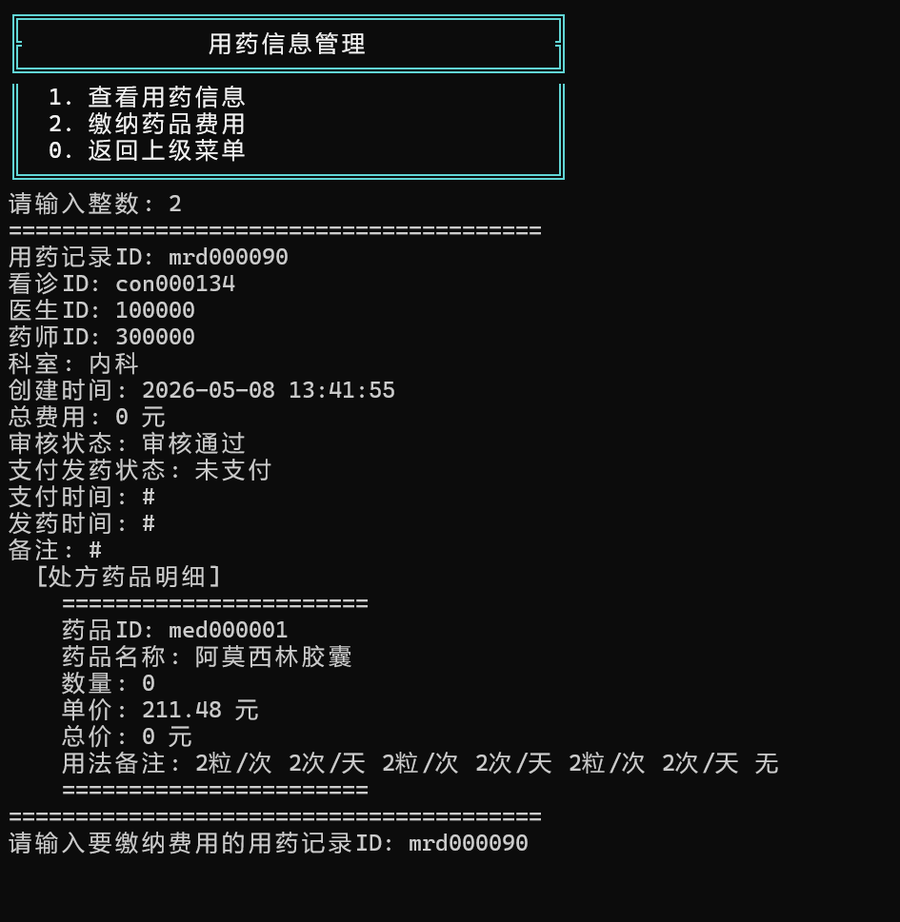{width=4.7in}

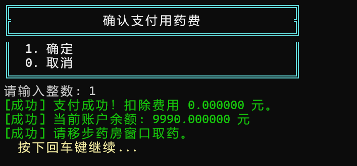{width=4.7in}

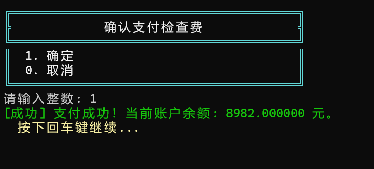{width=4.7in}

## XI. 数据文件、保存机制与运行维护

系统所有数据文件位于 Data/ 目录下，用户数据和业务数据分目录保存。用户数据包括管理员、医生、护士、药剂师和患者；业务数据包括挂号、看诊、检查、住院、床位、用药记录和药品信息。文件路径通过 User.h 中的宏定义集中维护，便于加载和保存函数统一调用。

txt 文件采用逗号分隔字段，空字段统一保存为 #。为了防止输入内容破坏文件结构，UI 输入校验函数会拒绝普通文本中的英文逗号和中文逗号。对于一条主记录下的多项子内容，系统使用附加行保存，例如处方、附件、检查项目、药品别名等会跟随主记录写入。

正常退出时，main.cpp 会依次保存管理员、医生、护士、药剂师、患者、挂号、看诊、检查、住院、用药记录、药品和床位链表，并释放动态分配的节点。异常退出或 Ctrl+C 中断时，信号处理函数调用 emergencySave()，尽量把当前内存链表写回文件。

操作日志由 LogManager 单例负责，日志按日期保存到 Data/OperationLog/。登录、注册、数据修改等关键操作会记录用户 ID、角色、操作类型和详情，便于现场检查和问题追踪。

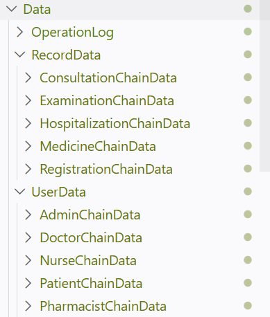{width=3.5in}

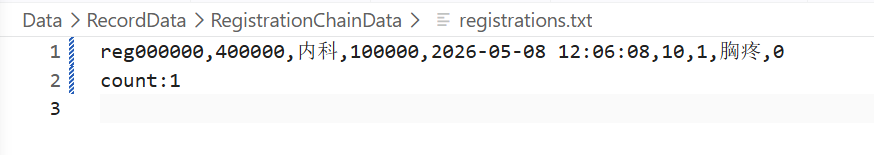{width=4.7in}

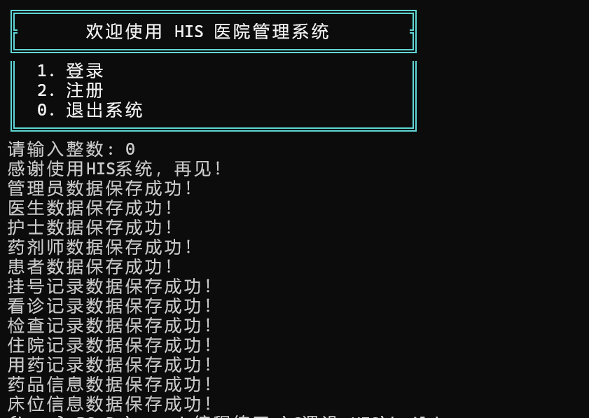{width=4.7in}

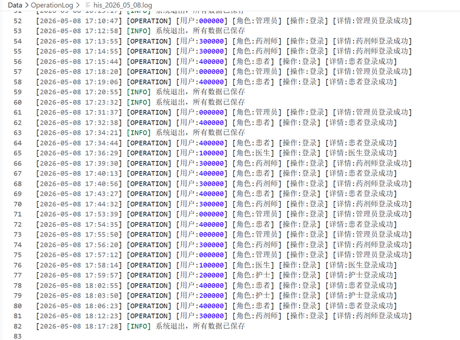{width=4.7in}

## XII. 终端界面、输入校验与测试验证

终端界面由 UI.cpp 统一绘制。菜单使用 Unicode 双线框，配合彩色提示、CJK 字符宽度计算、信息卡片、面包屑暂停提示和隐藏密码输入，使纯终端程序也能保持较清晰的交互体验。MENU_INNER_WIDTH 控制菜单内部宽度，printMenuTitle、printMenuItem、printMenuLine 等函数用于统一菜单布局。

输入校验覆盖了主要交互场景。selectIntCheck 用于限制菜单选项范围；inputFeeCheck、inputDoubleCheck、inputIntCheck 用于数值输入；inputStringCheck 拦截空字符串和逗号；inputIDCheck 校验 6 位用户 ID；inputRecordIDCheck 校验业务记录前缀和 6 位数字；inputPwdCheck 和 inputHiddenPwdCheck 校验密码复杂度并隐藏登录密码。

测试主要通过终端交互、数据文件检查和重新启动验证完成。重点测试包括首次启动创建管理员、连续错误密码触发锁定、患者挂号并缴费、医生创建看诊和检查、药剂师审核处方并发药、护士创建住院记录并分配床位、患者缴纳各类费用、非法输入拦截、正常退出保存和操作日志生成。

现场答辩建议先展示 build 目录运行和管理员登录，再展示管理员账户管理、医疗记录管理、药品管理、床位管理和统计报表；随后由组员演示患者挂号、医生看诊、药剂师审核发药、护士住院床位管理这一条业务闭环。这样既能体现组长负责的整体架构，也能展示各角色协同完成的系统功能。

| 测试类别 | 测试步骤 | 预期与实际结果 |
| --- | --- | --- |
| 首次启动与账户锁定 | 无管理员数据时启动程序；连续 5 次输入错误密码；由管理员重新激活账户 | 系统要求先创建管理员；错误次数达到上限后账户锁定；激活后可重新登录，结果符合预期 |
| 挂号到用药闭环 | 患者挂号并缴费；医生创建看诊和检查；药剂师审核处方；患者缴药品费；药剂师发药 | 记录 ID 依次生成，状态正确流转，药品库存扣减，结果符合预期 |
| 住院与床位管理 | 医生设置住院建议；护士创建住院记录、分配床位、调整床位并办理出院 | 床位状态正确变化，住院费用按病房类型和天数计算，结果符合预期 |
| 药品库存与发药扣减 | 管理员维护药品基础信息；药剂师根据已缴费用药记录发药 | 用药记录状态更新，Medicine 库存数量同步扣减，结果符合预期 |
| 非法输入拦截 | 输入越界菜单、错误 ID、负数金额、含逗号字符串、弱密码 | 程序提示重新输入，不进入错误业务分支，结果符合预期 |
| 数据持久化与日志 | 新增记录后正常退出或 Ctrl+C 中断；重新启动程序；查看日志文件 | 数据可重新加载，关键操作被写入日志，结果符合预期 |

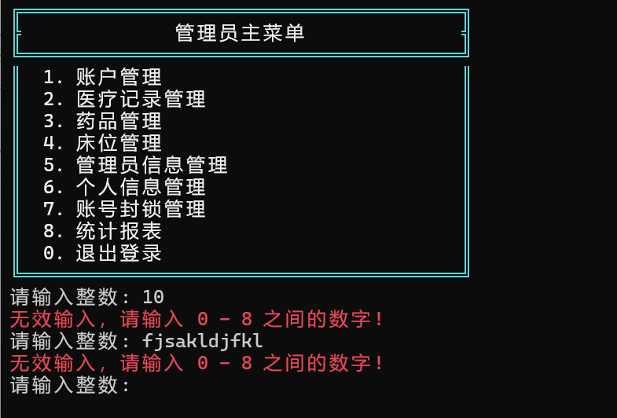{width=4.7in}

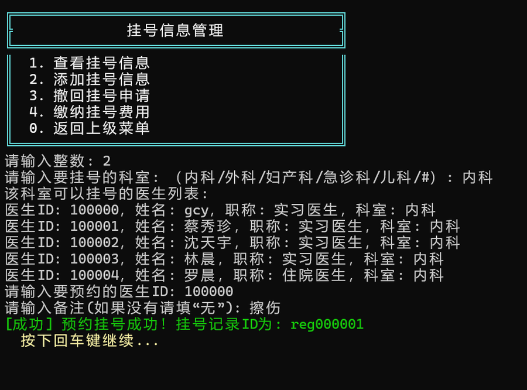{width=4.7in}

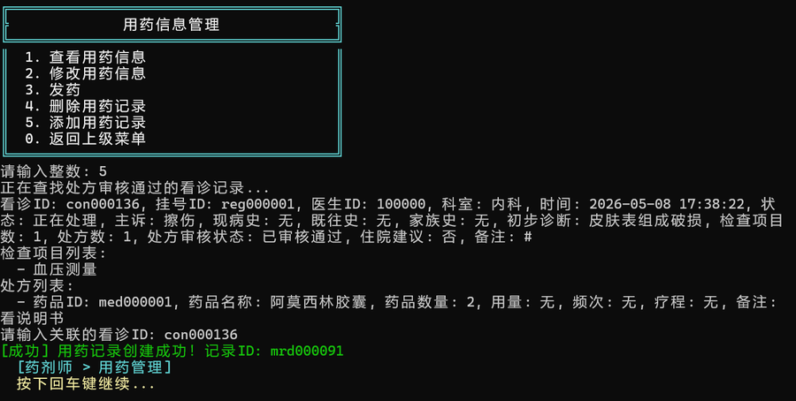{width=4.7in}

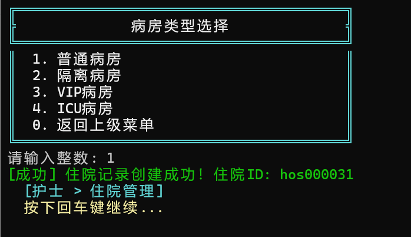{width=4.7in}

{width=4.7in}

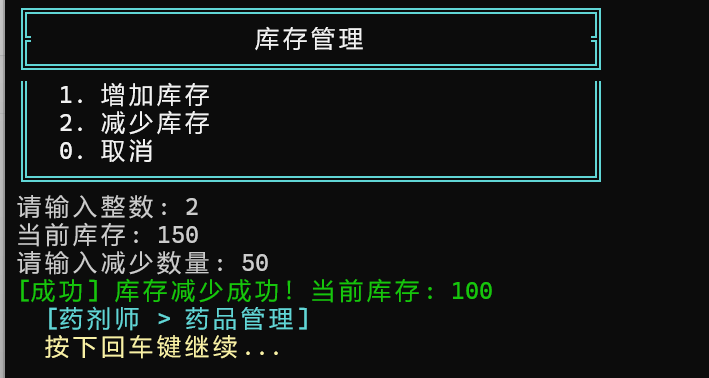{width=4.7in}
