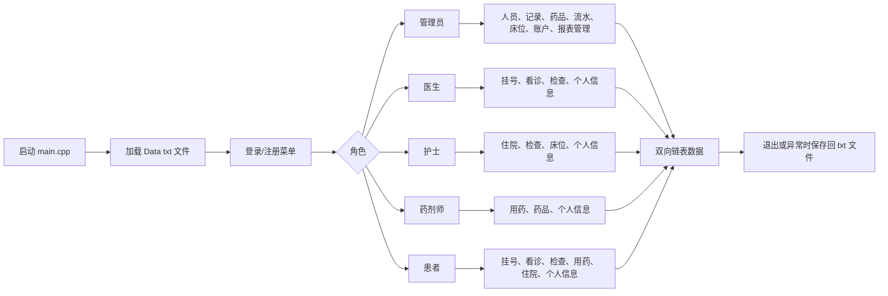

# 《程序设计基础课程设计》题签

**小组成员**：郭承宇（组长）/ 李阳旭

---

## 正文

编写一个 C++17 程序，面向小型医院或社区卫生服务场景，实现一个通过终端菜单交互运行的轻量级医院信息管理系统（Hospital Information System，简称 HIS）。系统以动态内存双向链表维护用户、医疗记录、床位和药品等数据，使用 txt 文本文件保存运行数据。最终提交版本仅通过终端菜单完成全部交互，程序入口为 `main.cpp`，头文件集中在 `Head/`，实现文件集中在 `Source/`，运行数据集中在 `Data/`。

### 1. 用户注册、登录与权限控制

a) 系统包含管理员、医生、护士、药剂师、患者五类用户。五类用户均继承自 `User` 基类，并在各自链表中独立保存账户信息。

- 管理员：管理医生、护士、药剂师、患者和管理员账户；管理挂号、看诊、检查、住院、用药记录；管理药品、药品出入库流水和床位；进行账户激活或封锁；查看统计报表；维护个人信息。
- 医生：管理本人相关挂号记录；由已缴费挂号记录创建看诊记录；填写主诉、现病史、既往史、家族史、初步诊断；添加检查项目和处方；设置住院建议；管理本人检查记录和个人信息。
- 护士：管理本科室住院记录；创建住院记录；分配护士、分配床位、调整床位、办理出院、设置押金；管理本科室检查记录；管理本科室床位和个人信息。
- 药剂师：管理本科室用药记录；创建由看诊处方转换而来的用药记录；审核处方；维护用药明细；在患者缴费后发药并扣减库存；管理药品信息和个人信息。
- 患者：预约挂号、撤回未缴费挂号、缴纳挂号费；查看本人看诊、检查、用药和住院信息；缴纳检查费、药品费和住院押金；申请出院；充值账户余额并维护个人信息。

b) 账户 ID 为 6 位数字：首位表示角色（0 管理员、1 医生、2 护士、3 药剂师、4 患者），后五位由对应角色计数器递增生成。挂号、看诊、检查、住院、用药、药品、药品流水等业务记录使用 `reg`、`con`、`exa`、`hos`、`mrd`、`med`、`mfl` 加 6 位数字的形式生成。

c) 为保护账户安全，系统不保存明文密码。注册和修改密码时使用随机盐值和 SHA-256 哈希函数进行 1000 次迭代，保存格式为 `salt$hash`；登录时通过 `SHA256Verify()` 进行校验，并采用逐字节异或比较减少时序差异。

d) 系统设置连续登录失败次数限制。用户连续 5 次输入错误密码后，账户状态被置为锁定，之后不能继续登录，需由管理员通过账号封锁管理功能重新激活。

e) 程序首次启动时若未读取到管理员数据，会要求先创建管理员账户，否则系统不能继续运行。

### 2. 核心信息管理

a) 系统使用动态内存双向链表作为主要数据结构。每类节点均包含 `prev` 和 `next` 指针，新增数据采用头插法加入链表，删除操作采用逻辑删除方式设置 `isDeleted` 标志。

b) 用户类数据共五类：

- `Admin`：管理员账户基本信息、账户状态和创建时间；
- `Doctor`：医生 ID、科室、职称、擅长方向、排班信息、在岗状态、累计接诊数、累计检查数、累计开具住院证数；
- `Nurse`：护士 ID、科室、等级、排班信息、在岗状态、护理人数和床位管理次数；
- `Pharmacist`：药剂师 ID、科室、等级、排班信息、在岗状态、审核次数、发药次数和库存管理次数；
- `Patient`：患者 ID、就诊科室、身份证号、地址、紧急联系人、过敏史、既往病史、婚姻状况、账户余额、是否住院中及各类就医次数。

c) 医疗与资源类数据共八类：

- `Registration`：挂号 ID、患者 ID、科室、医生 ID、挂号时间、挂号费、状态和备注；
- `Consultation`：看诊 ID、关联挂号 ID、患者 ID、医生 ID、科室、看诊时间、病史信息、初步诊断、检查项目列表、处方列表、处方审核标志、住院建议和状态；
- `Examination`：检查 ID、关联看诊 ID、患者 ID、医生 ID、科室、检查项目、下单时间、报告时间、报告摘要、生命体征、费用和状态；
- `Hospitalization`：住院 ID、关联看诊 ID、患者 ID、医生 ID、护士 ID、科室、病房类型、床位号、申请时间、入院时间、出院时间、押金、总费用和状态；
- `MedicationRecord`：用药记录 ID、关联看诊 ID、医生 ID、药剂师 ID、患者 ID、科室、创建时间、药品明细、总费用、审核状态、缴费/发药状态和备注；
- `Medicine`：药品 ID、名称、规格、生产厂家、进价、售价、库存、安全库存、生产日期、有效期、所属科室、通用名、别名列表、状态和备注；
- `MedicineFlow`：流水 ID、药品 ID、入库或出库类型、数量、操作人、原因、时间和备注；
- `bedInfo`：床位 ID、状态、病房类型、科室、区域号、病房号、床位号、备注、生命体征、绑定患者 ID、绑定护士 ID、使用次数和占用天数。

d) 系统预设五个科室：内科、外科、妇产科、急诊科、儿科。管理员查询时支持选择“全院”或指定科室；其他角色按自身身份和科室限制查看、修改相应记录。

e) 费用由代码中固定规则计算：

| 项目 | 计费依据 | 标准 |
| --- | --- | --- |
| 挂号费 | 医生职称 | 实习医师 10 元、住院医师 20 元、主治医师 30 元、副主任医师 40 元、主任医师 50 元 |
| 检查费 | 检查项目 | 体温 5 元、血压 8 元、心率 5 元、呼吸频率 5 元、血氧 10 元、身高 5 元、体重 5 元、BMI 5 元、疼痛评分 2 元、腰围 5 元、血糖 20 元、体脂 30 元、尿酸 25 元、血脂 25 元 |
| 住院费 | 病房类型乘住院天数 | 普通病房 50 元/天、隔离病房 100 元/天、VIP 病房 200 元/天、ICU 病房 500 元/天 |

### 3. 数据文件管理

a) 程序启动后通过 `LoadData.cpp` 将 txt 文件中的数据读入对应链表；程序正常退出、发生受控异常或收到 SIGINT、SIGABRT、SIGTERM 信号时，通过 `SaveData.cpp` 将链表数据写回文件。

b) 数据文件采用英文逗号分隔的文本格式。空字段统一使用 `"#"` 作为占位符。输入校验函数禁止在普通文本字段中录入英文逗号和中文逗号，以避免破坏文件字段结构。

c) 文件路径在 `User.h` 中以宏定义保存，程序需要从 `build/` 目录运行，使相对路径 `../Data/` 能正确定位数据目录。

| 数据类型 | 文件路径 |
| --- | --- |
| 管理员 | `Data/UserData/AdminChainData/admin_users.txt` |
| 医生 | `Data/UserData/DoctorChainData/doctor_users.txt` |
| 护士 | `Data/UserData/NurseChainData/nurse_users.txt` |
| 药剂师 | `Data/UserData/PharmacistChainData/pharmacist_users.txt` |
| 患者 | `Data/UserData/PatientChainData/patient_users.txt` |
| 挂号记录 | `Data/RecordData/RegistrationChainData/registrations.txt` |
| 看诊记录 | `Data/RecordData/ConsultationChainData/consultations.txt` |
| 检查记录 | `Data/RecordData/ExaminationChainData/examinations.txt` |
| 住院记录 | `Data/RecordData/HospitalizationChainData/hospitalizations.txt` |
| 床位信息 | `Data/RecordData/HospitalizationChainData/bed_info.txt` |
| 用药记录 | `Data/RecordData/MedicineChainData/medication_records.txt` |
| 药品信息 | `Data/RecordData/MedicineChainData/medicines.txt` |
| 药品流水 | `Data/RecordData/MedicineChainData/medicine_flow.txt` |

d) 对处方、附件、相关记录 ID、药品别名等一条主记录下的多项信息，保存函数采用附加行方式写入，例如 `PRESCRIPTION:`、`ATTACHMENT:`、`RELATED_...:` 和 `ALIAS:`。

### 4. 信息查询与统计报表

a) 系统按照角色提供多种查询方式，包括按 ID、科室、状态、患者 ID、医生 ID、护士 ID、药剂师 ID、药品 ID、药品名称、病房类型、床位状态和时间范围等条件查询。

b) 管理员可以从全院或科室视角查询人员、医疗记录、药品、流水和床位信息。患者只能查看与本人相关的挂号、看诊、检查、用药和住院记录；医生、护士、药剂师则主要查看与本人或本科室相关的数据。

c) 管理员统计报表包含以下内容：

- 科室统计总览：统计各科室医生数、挂号数、看诊数和挂号收入；
- 医生工作量统计：展示医生科室、职称、看诊数、检查数和住院证数量；
- 患者就诊统计：统计患者总数、住院中人数、账户余额合计、时间范围内挂号和看诊数量；
- 床位使用率统计：统计床位总数、占用数、可用数及各科室占用情况；
- 药品库存统计：统计药品种类、库存价值、低库存药品、过期药品以及时间范围内出入库数量。

### 5. 非法输入检测

系统在主要终端输入位置均设置校验函数，降低异常输入导致程序逻辑错误的可能性。

- `selectIntCheck()`：限定菜单选项范围；
- `inputFeeCheck()`、`inputDoubleCheck()`、`inputIntCheck()`：校验金额、浮点数和整数范围；
- `inputStringCheck()`：过滤空字符串和逗号；
- `inputIDCheck()`：校验 6 位用户 ID，首位必须为 0 至 4；
- `inputRecordIDCheck()`：校验 `reg`、`con`、`exa`、`hos`、`mrd`、`med`、`mfl` 等记录 ID 前缀和 6 位数字后缀；
- `inputPwdCheck()` 与 `inputHiddenPwdCheck()`：校验密码复杂度，并在登录时隐藏密码输入；
- `inputGenderCheck()`、`inputTelephoneCheck()`、`inputEmailCheck()`、`inputAgeCheck()`、`inputDateCheck()`、`inputDepartmentCheck()`、`inputIDcardCheck()`：校验性别、电话、邮箱、年龄、日期、科室和身份证号；
- `inputBedNumberCheck()` 与 `autoGenerateBedID()`：校验或生成床位编号。

### 6. 特色功能

a) **双向链表统一建模**：系统主要数据均以双向链表节点保存，便于在课程设计要求下完成动态增删查改，并在链表遍历时按角色权限筛选可见数据。

b) **密码加盐哈希与账户锁定**：自实现 SHA-256 相关函数，结合随机盐值和 1000 次迭代保存密码；连续失败 5 次后锁定账户，由管理员统一激活或封锁。

c) **终端交互界面**：`UI.cpp` 使用 Unicode 双线框绘制菜单，提供彩色提示、CJK 字符宽度计算、信息卡片、分页显示、面包屑式暂停提示和隐藏密码输入。

d) **操作日志**：`LogManager` 单例使用互斥锁写入日志，记录登录、注册、数据修改等关键操作，日志按日期保存到 `Data/OperationLog/`。

e) **紧急保存机制**：`main.cpp` 注册信号处理函数，并在异常捕获中调用 `emergencySave()`，尽量保证程序非正常退出时仍可将内存中的链表写回数据文件。

f) **泛型账户管理**：`Login.h` 中的 `AccountManageGeneric<UserType>()` 使用模板函数统一处理不同角色账户的激活和封锁逻辑，减少重复代码。

g) **模块化源码组织**：程序按头文件和实现文件分离，`User` 为基类，`Admin`、`Doctor`、`Nurse`、`Pharmacist`、`Patient` 为派生类，数据加载、保存、登录、界面和时间功能分别放在独立文件中，便于小组分工和后续维护。

### 7. 小组工作流

a) 使用 Git 管理代码版本，并维护开发日志记录阶段性修改内容、已知问题和修复情况。

b) 使用 CMake 描述控制台程序构建目标，采用 C++17 标准编译。最终提交版本以 `main.cpp` 为入口，通过终端菜单完成全部功能。

c) 代码命名尽量保持统一：头文件采用 PascalCase，成员函数和普通函数多采用 camelCase，业务结构体和枚举集中定义在 `Head/` 下。

d) 文档与数据文件随项目同步维护，保证现场检查时可以直接配置、编译、运行并读取 `Data/` 下的 txt 数据。

### 8. 程序主要功能简图

